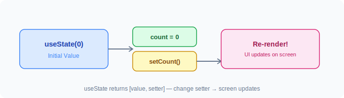
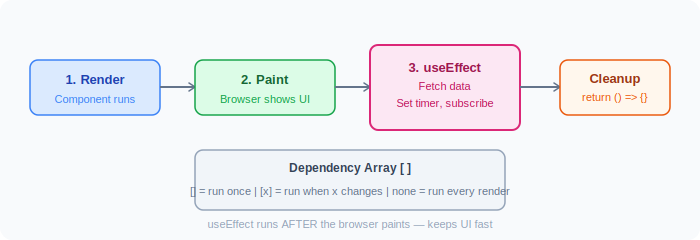
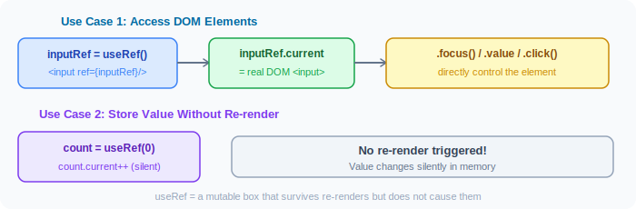
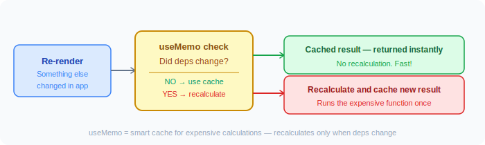
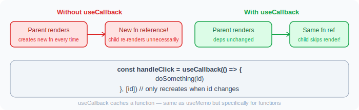
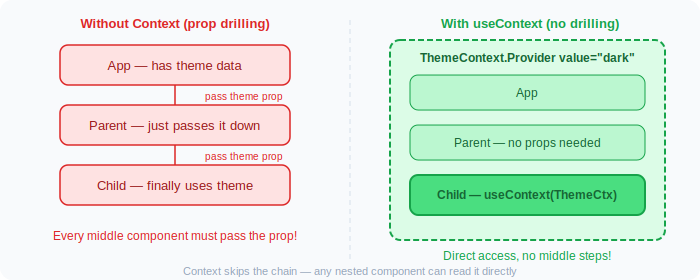
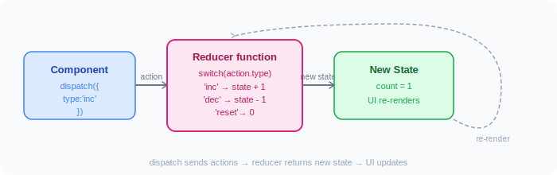
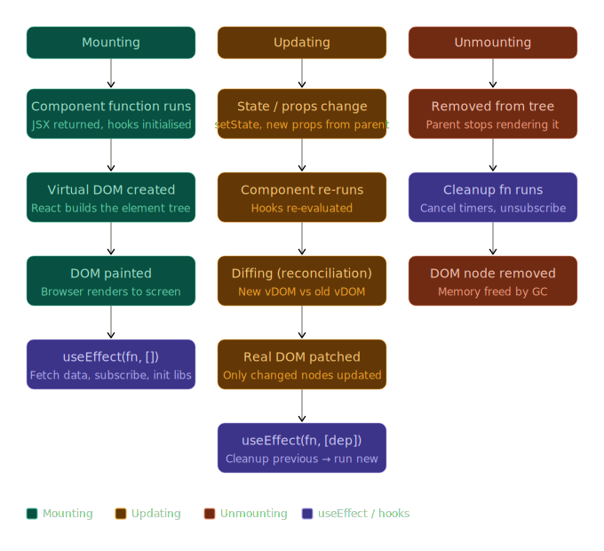

# ⚛️ React Notes — Complete Study Guide

## Syllabus

- ReactJs features (VirtualDOM, Reconciliation)
- Local Environment Setup (Create-react-app, Vite)
- JSX
- Class Components
- Functional Components
- React Object
- Fragment
- Component Styling
- Conditional Rendering
- Lists & Keys
- Props: destructuring, requiring props, PropTypes, default props
- State
- Pure Component
- Memo Component
- Higher Order Component
- Events: Synthetic Event
- Lifecycle Hooks
- Form
- HTTP - Axios
- Interceptors
- Routing
- Redux (State Management)
- Unit Testing (Jest)
- ESLint

---


## What React Is

> **Key Idea: `UI = function(state)`**  
> Instead of manually updating the DOM, React lets you describe **what the UI should look like** — and it handles updates efficiently.

- React is a **JavaScript library** for building user interfaces.
- It is an open-source, **component-based** library.
- Created & maintained by **Facebook**.
- Used to build **Single Page Applications (SPAs)**.
- Allows creation of **reusable UI components**.
- Uses **Virtual DOM** mechanism to fill in data (views) in HTML DOM.

### Traditional Way (Without React)

```html
<div id="app"></div>

<script>
  let count = 0;

  function updateUI() {
    document.getElementById("app").innerText = count;
  }

  function increment() {
    count++;
    updateUI();
  }

  updateUI();
</script>
```

**Problems:** Manual DOM updates, hard to scale, messy when app grows.

### The React Way

```jsx
function App() {
  const [count, setCount] = React.useState(0);

  return (
    <div>
      <h1>{count}</h1>
      <button onClick={() => setCount(count + 1)}>Click</button>
    </div>
  );
}
```

React automatically: tracks state, updates UI, and re-renders efficiently.

---

## React is NOT a Framework

> React is a library — it only takes care of the UI.  
> Angular is a framework — it handles Dependency Injection, CSS encapsulation, httpClient, Form validation, routing, etc.

### Declarative vs Imperative

**Imperative (jQuery style)** — "HOW to do things":
```js
document.getElementById("title").innerText = "Hello";
```

**React (Declarative)** — "WHAT it should look like":
```jsx
<h1>Hello</h1>
```

## Framework vs Library

| Framework | Library |
|-----------|---------|
| Group of libraries to make work easier | Performs specific, well-defined operations |
| Provides ready-to-use tools, standards, templates | Provides reusable functions for code |
| Collection of libraries & APIs | Collection of helper functions, objects |
| Cannot be easily replaced | Can be easily replaced by another |
| Angular, Vue | jQuery, ReactJs, lodash, moment |
| Hospital with full of doctors | A doctor who specializes in one area |


## React vs Angular

| | React | Angular |
|--|-------|---------|
| Type | Library (2013) | Framework (2009) |
| Size | Light-weight | Heavy |
| Language | JSX + JavaScript | HTML + TypeScript |
| Data Flow | Uni-Directional | Two-way |
| DOM | Virtual DOM | Regular DOM |
| HTTP | Axios | HttpClientModule |
| DI | No | Yes |
| Form Validation | No | Yes |
| Extra Libraries | Needed | Not required |
| Focus | UI heavy | Functionality Heavy |

### Ecosystem & Flexibility

React is NOT a full framework — you choose your own stack:
- Use **Next.js** for full-stack apps
- Use libraries for state, routing, animations, etc.

---

# React Features

- **Light-weight**
- **JSX** — HTML-like syntax in JavaScript
- **Components** — easy to build, extend, reuse, loosely coupled
- **One-way Data Binding** — no watchers for bindings
- **Virtual DOM** — fast, efficient updates
- **Easy to learn** — simple design
- **High Performance**

---

## DOM and Virtual DOM

### DOM (Document Object Model)

- A tree-like structure representing the HTML of a web page.
- Allows JavaScript to interact with and modify the page's content, structure, and style.

### Why Virtual DOM?

- Frequent DOM manipulations are expensive and performance-heavy.
- Every time the DOM changes, browser recalculates CSS, runs layout, and repaints the page.
- Virtual DOM minimizes the time it takes to repaint the screen.

### What is Virtual DOM?

- A **lightweight JavaScript object** that is a copy of the real DOM.
- A node tree that lists elements, their attributes, and content as objects.
- React **never reads from real DOM, only writes to it**.

### Virtual DOM Benefits

- **Improved Performance** – Reduces the number of direct DOM manipulations.
- **Optimized Updates** – React intelligently determines the most efficient update path, minimizing costly reflows and repaints.
- **Simplified Development** – Abstracts away complexities of direct DOM manipulation.

### How React Works (Virtual DOM)

1. **Initial Render** – React creates a Virtual DOM tree based on initial JSX.
2. **State Changes** – When state changes, React generates a new Virtual DOM tree.
3. **Diffing** – React compares new Virtual DOM with previous Virtual DOM, identifying what changed.
4. **Reconciliation** – React calculates the minimal real DOM operations needed.
5. **Real DOM Update** – Only necessary changes are applied to the real DOM.

### Shadow DOM vs Virtual DOM

| | Shadow DOM | Virtual DOM |
|--|------------|-------------|
| What | Browser technology for scoping variables and CSS in web components | Concept implemented by React on top of browser APIs |

### ReactDOM

- ReactDOM is the **glue between React and the DOM**.
- React creates a Virtual DOM; ReactDOM efficiently updates the real DOM based on it.

---

## React Reconciliation

- Reconciliation is the process of syncing the Virtual DOM to the actual DOM.
- Tracks changes in component state and renders updated state to the screen.


### Fiber Reconciler (React 16+)
- Asynchronous (new reconciliation engine in React v16)
- Divides work into multiple units (incremental rendering)
- Sets priority for each work unit — can **pause, reuse, and abort** work
- Separates reconciliation into two phases:
  - **Phase 1: Render/Processing** – React creates a list of all UI changes (can be interrupted)
  - **Phase 2: Commit** – React applies the changes to the real DOM (cannot be interrupted)


---

# Virtual DOM vs Real DOM in React

A complete visual guide to how React's reconciliation engine works — from state change to screen update.

## 1. What is the Real DOM?

The **Real DOM** is the browser's live tree representation of your HTML page. Every change (even a single text update) triggers an expensive rendering pipeline:


DOM change → Style calculation → Layout reflow → Repaint → Compositing


## 2. What is the Virtual DOM?

The **Virtual DOM** is React’s lightweight JavaScript copy of the UI. When state/props change, React:

- Builds a new Virtual DOM tree
- Diffs it with the previous one (Reconciliation)
- Calculates the **minimum** changes
- Applies them in **one batch** to the Real DOM

### Virtual DOM Node Example

```js
// <div className="card"><h1>Hello</h1></div> becomes:
{
  type: "div",
  props: { className: "card" },
  children: [
    { type: "h1", props: {}, children: ["Hello"] }
  ]
}
```

## 3. The Full Update Cycle


## 4. The Diffing Algorithm (Reconciliation)

React uses smart heuristics for fast O(n) diffing:

- **Rule 1**: Different element types → entire subtree is replaced (state lost)
- **Rule 2**: Same type → only changed props/attributes are updated
- **Rule 3**: Lists must have stable `key` props for efficient add/move/remove

```jsx
// Recommended
{items.map(item => <li key={item.id}>{item.name}</li>)}
```

## 5. Mental Model


Think of the Virtual DOM as a cheap **blueprint** and the Real DOM as the actual **building**. React only patches the necessary bricks.

## 6. Real DOM vs Virtual DOM Comparison

| Property               | Real DOM                          | Virtual DOM                          |
|------------------------|-----------------------------------|--------------------------------------|
| Location               | Browser memory                    | JavaScript memory                    |
| Creation               | Browser HTML parser               | React (`createElement`)              |
| Update Cost            | Expensive (reflow + repaint)      | Very cheap                           |
| Mutation               | Direct & slow                     | Free (old tree discarded)            |
| When Updated           | Immediately                       | After reconciliation (batched)       |

## 7. Code Example

```jsx
function PriceTag({ price }) {
  return <span className="price">${price}</span>;
}

function App() {
  const [price, setPrice] = useState(10);

  return (
    <div>
      <h1>Product</h1>
      <PriceTag price={price} />
      <button onClick={() => setPrice(p => p + 1)}>
        Increase price
      </button>
    </div>
  );
}
```

Clicking the button only updates the price `<span>` in the Real DOM — everything else stays untouched.

## 8. Key Takeaways

- Real DOM mutations are expensive.
- Virtual DOM makes updates cheap and declarative.
- Reconciliation finds minimal changes.
- Always use `key` props on lists.
- Changing element type (`<div>` → `<span>`) destroys the subtree.
- This is the foundation of React Fiber (still used in React 18+ / 19+).

**React Virtual DOM & Reconciliation Deep Dive**


---

## React Project Structure

| File/Folder | Description |
|-------------|-------------|
| `node_modules/` | npm packages for the entire workspace |
| `public/` | Only files here can be referenced from HTML |
| `src/` | Source files for the root-level application |
| `.gitignore` | Files Git should ignore |
| `package.json` | Configures npm package dependencies |
| `package-lock.json` | Version info for all installed packages |
| `README.md` | Introductory documentation |

### React Project Flow

```
index.html  -->  <div id="root"></div>
index.js    -->  root = ReactDOM.createRoot(document.getElementById('root'))
                 root.render(<App />)
App.js      -->  App Component Code
```

### Mental Model (Important!)

When you write `<App />`, React:
1. Calls function `App()`
2. Gets JSX back
3. Converts JSX to JS objects
4. Updates the real DOM

---

# JSX

> **JSX = JavaScript XML** — HTML-like syntax inside JavaScript.

- **JSX** (JavaScript Syntax Extension) is special syntax for React to represent UI.
- JSX allows adding elements to DOM without using `createElement()` or `appendChild()`.
- JSX looks similar to HTML but **is not HTML**.
- JSX code gets transformed into `React.createElement()` by **Babel**.
- JSX doesn't support void tags — `` is invalid; use `` or `</img>`.
- React DOM uses **camelCase** property naming: `class` → `className`, `tabindex` → `tabIndex`.

### How JSX Works Internally

This JSX:
```jsx
const element = <h1>Hello</h1>;
```
gets converted into:
```js
const element = React.createElement("h1", null, "Hello");
```

### Nested JSX Breakdown

```jsx
// JSX
const element = (
  <div>
    <h1>Hello</h1>
    <p>Welcome</p>
  </div>
);

// Converted JS (what Babel produces)
const element = React.createElement(
  "div",
  null,
  React.createElement("h1", null, "Hello"),
  React.createElement("p", null, "Welcome")
);
```

### Why JSX is Powerful

**1. Embed JavaScript inside UI:**
```jsx
const name = "Prathamesh";
<h1>Hello {name}</h1>
```

**2. Dynamic Rendering:**
```jsx
const isLoggedIn = true;
return (
  <div>
    {isLoggedIn ? <h1>Welcome</h1> : <h1>Please Login</h1>}
  </div>
);
```

**3. Lists Rendering:**
```jsx
const items = ["A", "B", "C"];
return (
  <ul>
    {items.map((item, index) => (
      <li key={index}>{item}</li>
    ))}
  </ul>
);
```

### JSX Rules (Important)

**1. One Parent Element:**

❌ Wrong:
```jsx
return (
  <h1>Hello</h1>
  <p>World</p>
);
```

✅ Correct:
```jsx
return (
  <div>
    <h1>Hello</h1>
    <p>World</p>
  </div>
);
// OR use Fragment
<>
  <h1>Hello</h1>
  <p>World</p>
</>
```

**2. Use `className` not `class`:**
```jsx
<div className="box"></div>
```

**3. Close all tags:**
```jsx

```

### React Without JSX

```js
// Syntax
React.createElement(type, [props], [...children])

// Example
React.createElement("div", { class: "test" }, "This is a div");
// is equivalent to JSX:
// <div class='test'>This is a div</div>
```

> Modern tools like **Vite** and **Babel** automatically convert JSX → JS. You never write `React.createElement` manually.

---

## React Element

- A React element is a JavaScript object with specific properties and methods.
- Created using `React.createElement()`.
- `document.createElement()` returns a **DOM element**.
- `React.createElement()` returns an **object representing the DOM element**.

```js
const hello = React.createElement(
  "H1",
  { id: "msg", className: "title" },
  "Hello React Element"
);
```

---

## Module Systems & Imports/Exports

### CommonJS
```js
module.exports = { member1, member2 };
const member1 = require('Library/file name');
```

### ECMAScript
```js
export member1;
export default member2;
import DefaultMember, { NamedMember } from 'file';
```

### Named Export vs Default Export

- Only **one default export** per file; **multiple named exports** are allowed.
- Default export can be a function, class, or object (not a variable).
- Named import must use the **same name** as the export.
- Default import can use **any name**.

```js
import MyReact, { MyComponent } from "react";
```

---

# Components


# ⚛️ What is a Component?

In **React**, a **component is a reusable, independent piece of UI**.

👉 Think of it like:

* A function
* That returns UI (JSX)
* Based on input (props + state)

---

## 🧠 Mental Model

> Component = Function → takes input → returns UI

```jsx
function Greeting() {
  return <h1>Hello</h1>;
}
```

👉 This is a component.

---

# 🔥 Why Components Are Powerful

* Reusability
* Separation of concerns
* Easy maintenance
* Scalable architecture

---
# Compoenets Rule
- Components are the most basic UI building blocks of a React application.
- Each component outputs a small, reusable piece of HTML.
- Components are **re-usable** and can be nested.
- React requires the **first letter of a component to be capitalized** — this is how JSX tells the difference between an HTML tag and a component instance.

### Component-Based Architecture

React splits UI into reusable pieces:

```jsx
function Button() {
  return <button>Click me</button>;
}

// Reuse anywhere
<Button />
<Button />
```


---


# 🧩 Types of Components (Important)

### 2 Types of Components

| Functional Component | Class Component |
|----------------------|----------------|
| No `this` keyword | More feature-rich |
| Solution without state | Maintains own private data (state) |
| Mainly for UI | Complex UI logic |
| Stateless/dumb/Presentational | Provides lifecycle hooks |

```js
// Functional Component
function Welcome(props) {
  return <h1>Hello, {props.name}</h1>;
}

// Class Component
class Welcome extends React.Component {
  render() {
    return <h1>Hello, {this.props.name}</h1>;
  }
}
```

> **Note:** From React 16.8+, Hooks allow using state and lifecycle in functional components. It is always recommended to use **functional components**.


## 1. Functional Components (Modern Standard ✅)

This is what you SHOULD use in 2026.

```jsx
function Welcome() {
  return <h1>Welcome to React</h1>;
}
```

👉 Use it:

```jsx
<Welcome />
```

---

### With Props (Dynamic Component)

```jsx
function Greeting(props) {
  return <h1>Hello {props.name}</h1>;
}
```

👉 Usage:

```jsx
<Greeting name="Prathamesh" />
```

👉 Output:

```
Hello Prathamesh
```

---

### With Destructuring (Best Practice)

```jsx
function Greeting({ name }) {
  return <h1>Hello {name}</h1>;
}
```

---

## 2. Class Components (Legacy ⚠️)

Used before hooks.

```jsx
class Welcome extends React.Component {
  render() {
    return <h1>Hello</h1>;
  }
}
```

👉 Avoid in modern apps unless maintaining old code.

---

# 🧠 Types Based on Usage Pattern

This is where real understanding starts.

---

## 🔹 3. Presentational Components (UI Only)

👉 Only responsible for UI

```jsx
function Button({ label }) {
  return <button>{label}</button>;
}
```

👉 No logic, just display

---

## 🔹 4. Container Components (Logic Handling)

👉 Handles data & logic

```jsx
function CounterContainer() {
  const [count, setCount] = React.useState(0);

  return (
    <button onClick={() => setCount(count + 1)}>
      {count}
    </button>
  );
}
```

---

## 🔹 5. Controlled Components

👉 Form elements controlled by React state

```jsx
function InputField() {
  const [value, setValue] = React.useState("");

  return (
    <input
      value={value}
      onChange={(e) => setValue(e.target.value)}
    />
  );
}
```

👉 React controls the input

---

## 🔹 6. Uncontrolled Components

👉 DOM handles state

```jsx
function InputField() {
  const inputRef = React.useRef();

  function handleClick() {
    console.log(inputRef.current.value);
  }

  return (
    <>
      <input ref={inputRef} />
      <button onClick={handleClick}>Submit</button>
    </>
  );
}
```

---

## 🔹 7. Higher-Order Components (HOC)

👉 Function that wraps another component

```jsx
function withLogger(Component) {
  return function WrappedComponent(props) {
    console.log("Rendering...");
    return <Component {...props} />;
  };
}
```

👉 Usage:

```jsx
const Enhanced = withLogger(MyComponent);
```

---

## 🔹 8. Custom Hook Components (Logic Reuse)

👉 Not UI, but reusable logic

```jsx
function useCounter() {
  const [count, setCount] = React.useState(0);
  return { count, setCount };
}
```

👉 Use inside component:

```jsx
function Counter() {
  const { count, setCount } = useCounter();

  return (
    <button onClick={() => setCount(count + 1)}>
      {count}
    </button>
  );
}
```

---

## 🔹 9. Compound Components (Advanced Pattern)

👉 Components that work together

```jsx
function Card({ children }) {
  return <div className="card">{children}</div>;
}

Card.Title = function ({ children }) {
  return <h2>{children}</h2>;
};

Card.Body = function ({ children }) {
  return <p>{children}</p>;
};
```

👉 Usage:

```jsx
<Card>
  <Card.Title>Title</Card.Title>
  <Card.Body>Description</Card.Body>
</Card>
```

---

## 🔹 10. Layout Components

👉 Used for structure

```jsx
function Layout({ children }) {
  return (
    <div>
      <header>Header</header>
      <main>{children}</main>
    </div>
  );
}
```

---

# 🔄 Component Lifecycle (Functional Way)

Earlier (class):

* componentDidMount
* componentDidUpdate

Now:
👉 handled using `useEffect`

```jsx
function Example() {
  React.useEffect(() => {
    console.log("Mounted");

    return () => {
      console.log("Unmounted");
    };
  }, []);

  return <h1>Example</h1>;
}
```

---


# ⚛️ What are Props?

In **React**, **props (short for properties)** are:

> 👉 Inputs passed from a parent component to a child component

They allow components to be **dynamic and reusable**.

---

## 🧠 Simple Analogy

Think of a component like a function:

```js
function greet(name) {
  return "Hello " + name;
}
```

👉 `name` = input

Similarly in React:

```jsx
function Greeting(props) {
  return <h1>Hello {props.name}</h1>;
}
```

👉 `props.name` = input

---

# 🔹 Basic Example

### Parent Component

```jsx
function App() {
  return <Greeting name="Prathamesh" />;
}
```

### Child Component

```jsx
function Greeting(props) {
  return <h1>Hello {props.name}</h1>;
}
```

👉 Output:

```
Hello Prathamesh
```

---

# 🔥 Props Flow (VERY IMPORTANT)

👉 Props flow **one-way (top → down)**

```
Parent → Child → Grandchild
```

❌ Child cannot directly change parent props

---

# 🧩 Multiple Props

```jsx
function User({ name, age }) {
  return (
    <h1>
      {name} is {age} years old
    </h1>
  );
}
```

👉 Usage:

```jsx
<User name="Prathamesh" age={25} />
```

---

# 🎯 Props with Different Types

## 1. String

```jsx
<Greeting name="John" />
```

---

## 2. Number

```jsx
<User age={25} />
```

---

## 3. Boolean

```jsx
<Button isActive={true} />
```

---

## 4. Array

```jsx
function List({ items }) {
  return (
    <ul>
      {items.map((item) => (
        <li key={item}>{item}</li>
      ))}
    </ul>
  );
}
```

👉 Usage:

```jsx
<List items={["A", "B", "C"]} />
```

---

## 5. Object

```jsx
function Profile({ user }) {
  return <h1>{user.name}</h1>;
}
```

👉 Usage:

```jsx
<Profile user={{ name: "Prathamesh" }} />
```

---

## 6. Function (VERY IMPORTANT)

👉 Used for event handling & communication

```jsx
function Button({ onClick }) {
  return <button onClick={onClick}>Click</button>;
}
```

👉 Parent:

```jsx
function App() {
  function handleClick() {
    alert("Clicked!");
  }

  return <Button onClick={handleClick} />;
}
```

---

# 🔄 Props Are Read-Only (IMPORTANT)

❌ Wrong:

```jsx
function Greeting(props) {
  props.name = "Changed"; // ❌ not allowed
}
```

👉 Props are immutable

---

# 🧠 Destructuring Props (Best Practice)

Instead of:

```jsx
function Greeting(props) {
  return <h1>{props.name}</h1>;
}
```

✅ Do this:

```jsx
function Greeting({ name }) {
  return <h1>{name}</h1>;
}
```

---

# 🧩 Default Props

```jsx
function Greeting({ name = "Guest" }) {
  return <h1>Hello {name}</h1>;
}
```

👉 Usage:

```jsx
<Greeting />
```

👉 Output:

```
Hello Guest
```

---

# 🧒 Children Prop (VERY IMPORTANT)

Every component automatically gets a special prop:

👉 `children`

```jsx
function Card({ children }) {
  return <div className="card">{children}</div>;
}
```

👉 Usage:

```jsx
<Card>
  <h1>Title</h1>
  <p>Description</p>
</Card>
```

👉 Output:

```
Card containing Title + Description
```

---

# 🔁 Props vs State (Common Confusion)

| Props              | State                    |
| ------------------ | ------------------------ |
| Passed from parent | Managed inside component |
| Read-only          | Mutable                  |
| External data      | Internal data            |

---

# 🔥 Real-World Example

```jsx
function ProductCard({ name, price, onBuy }) {
  return (
    <div>
      <h2>{name}</h2>
      <p>₹{price}</p>
      <button onClick={onBuy}>Buy</button>
    </div>
  );
}
```

👉 Parent:

```jsx
function App() {
  function handleBuy() {
    alert("Purchased!");
  }

  return (
    <ProductCard
      name="Laptop"
      price={50000}
      onBuy={handleBuy}
    />
  );
}
```

---

# ⚠️ Common Mistakes

### ❌ Forgetting `{}` for JS

```jsx
<User age="25" />   // string ❌
<User age={25} />   // number ✅
```

---

### ❌ Mutating Props

Never do:

```jsx
props.value = 10;
```

---

### ❌ Overusing Props (Prop Drilling)

Passing props deeply:

```jsx
<App → Parent → Child → Grandchild>
```

👉 Solution:

* Context API
* State management

---

# 🧠 Advanced Concept: Props Drilling

```jsx
function App() {
  return <Parent name="Prathamesh" />;
}

function Parent({ name }) {
  return <Child name={name} />;
}

function Child({ name }) {
  return <h1>{name}</h1>;
}
```

👉 Passing through layers = prop drilling

---

# ⚡ Final Mental Model

> Props = Input to component
> State = Memory inside component

---

---

# 🧠 Important Concepts You MUST Understand

## 1. Props (Read-only input)

```jsx
function User({ name }) {
  return <h1>{name}</h1>;
}
```

👉 Cannot modify props inside component ❌

---

## 2. State (Internal data)

```jsx
const [count, setCount] = React.useState(0);
```

👉 Changes trigger re-render

---

## 3. Re-rendering

Whenever:

* State changes
* Props change

👉 Component re-renders

---

# 🔥 Real Example (Putting Everything Together)

```jsx
function UserCard({ name }) {
  const [likes, setLikes] = React.useState(0);

  return (
    <div>
      <h2>{name}</h2>
      <p>Likes: {likes}</p>
      <button onClick={() => setLikes(likes + 1)}>
        Like
      </button>
    </div>
  );
}
```

👉 Usage:

```jsx
<UserCard name="Prathamesh" />
```

---

# ⚡ Best Practices (Senior Level)

* Keep components small
* Reuse components
* Extract logic into hooks
* Avoid prop drilling (use context)
* Separate UI & logic

---

# 🧠 Final Mental Model

Think like this:

```
App
 ├── Header
 ├── Sidebar
 ├── Content
 │    ├── Card
 │    ├── Table
 │    └── Chart
 └── Footer
```

👉 Everything is a component.

---

# ⚛️ What are Hooks (Simple Explanation)

In **React**:

> 👉 Hooks are functions that let your component **remember things** and **react to changes**

---

## 🧠 Think Like This

A normal function:

```js
function test() {
  let count = 0;
  count++;
  console.log(count);
}
```

👉 Every time you call it → `count` resets to 0

---

### But React component needs memory

```jsx
function Counter() {
  const [count, setCount] = React.useState(0);

  return <h1>{count}</h1>;
}
```

👉 Now React **remembers count between renders**

---

# 🔥 Why Hooks Exist (In One Line)

> Hooks = give **memory + lifecycle + logic reuse** to functional components

---

# 🧩  Hooks Types (Explained Simply)

---

# 🔹 1. useState → “Memory”

> *Simple Explanation*: 👉 Normally, a function forgets everything once it finishes running. useState gives your component a memory. It lets you create a variable that React will remember, and when you update that variable, React automatically updates the screen to show the new value.

Example: A simple click counter.

👉 Used to store data

```jsx
import { useState } from 'react';

function Counter() {
  // We create a piece of memory called "count", starting at 0.
  // "setCount" is the special tool we use to update "count".
  const [count, setCount] = useState(0);

  return (
    <div>
      <p>You clicked {count} times</p>
      {/* When the button is clicked, we tell React to update the memory */}
      <button onClick={() => setCount(count + 1)}>
        Click me
      </button>
    </div>
  );
}
```


### 📊 How it works
 


### 🧠 Simple idea:

* `count` → value
* `setCount` → update value

👉 When you update → React re-renders

---

# 🔹 2. useEffect → “Do something after render”

> *Explanation*:  👉 Sometimes your component needs to do things outside of just drawing the UI—like fetching data from the internet, setting a timer, or updating the browser tab's title. useEffect tells React: "Hey, finish drawing the screen first, and then go do this extra task."

Example: Changing the browser tab title when the counter changes.

👉 Used for:

* API calls
* timers
* logging

```jsx
function App() {
  React.useEffect(() => {
    console.log("Page loaded");
  }, []);

  return <h1>Hello</h1>;
}
```


---

### With dependency:

```jsx
useEffect(() => {
  console.log("Count changed");
}, [count]);
```

👉 Runs only when `count` changes

  ### 🧠 Simple idea:
  
  > “Run this code after UI is shown”


### 📊 How it works
 

---

# 🔹 3. useRef → “Store value without re-render”

> Explanation: 👉 useRef is like a sticky note that your component can write on. You can use it for two main things:  
>To grab a direct reference to an actual HTML element (like an input box) so you can force it to do something, like be clicked or typed into.
>To remember a value that changes, but without forcing React to redraw the screen (unlike useState).

Example: Automatically focusing an input box when the page loads.

👉 Like a hidden box

```jsx
function App() {
  const ref = React.useRef(0);

  function increase() {
    ref.current++;
    console.log(ref.current);
  }

  return <button onClick={increase}>Click</button>;
}
```

### 🧠 Simple idea:

> Value changes, but UI does NOT update

### 📊 How it works
 


---

# 🔹 4. useMemo → “Cache calculation”

> Simple Explanation: Imagine a math problem that takes 10 seconds to solve. You don't want to re-solve it every time the screen blinks. useMemo solves it once, "remembers" the answer, and only re-calculates if the input numbers change. It's for performance.

👉 Avoid re-running heavy code

```jsx
const result = React.useMemo(() => {
  return num * 2;
}, [num]);
```

### 🧠 Simple idea:

> “Only recalculate when needed”

### 📊 How it works
 


---

# 🔹 5. useCallback → “Keep same function”

> Simple Explanation: Every time a component re-renders, it creates its functions from scratch. Usually, that's fine. But if you're passing a function to a child component, it might think it's getting a "new" function every time. useCallback "locks" the function so it stays the same between renders.

```jsx
const handleClick = React.useCallback(() => {
  console.log("Clicked");
}, []);
```

### 🧠 Simple idea:

> “Don’t recreate function again and again”


### 📊 How it works
 

---

# 🔹 6. useContext → “Global data”

> Simple Explanation: If you have data at the top of your app (like the user's logged-in name or a dark/light theme) and you need it way down at the bottom, passing it step-by-step through every component in between is annoying (this is called "prop drilling"). useContext acts like a teleporter, allowing you to grab that data directly from anywhere in your app.

👉 Example: Checking if dark mode is on.

👉 Avoid passing props everywhere

```jsx
import { useContext, createContext } from 'react';

// 1. Create a "radio station" that broadcasts the theme
const ThemeContext = createContext('light'); 

function MyComponent() {
  // 2. "Tune in" to the station to get the current theme directly!
  const theme = useContext(ThemeContext); 

  return <p>The current theme is {theme}.</p>;
}
```

 
### 📊 How it works
 


### 🧠 Simple idea:

> “Share data anywhere without props”

---

# 🔹 7. useReducer → “Advanced state”

> Simple Explanation: If useState is like a simple sticky note, useReducer is like a professional office manager. Use it when you have a lot of states that change together (like a complex form or a game). Instead of saying "change this," you send an "action" (like "ADD_ITEM"), and the reducer follows a set of rules to update everything.

👉 Like `useState` but better for complex logic

```jsx
import { useReducer } from 'react';

// The "Rules": How state should change based on the "action"
function reducer(state, action) {
  switch (action.type) {
    case 'increment': return { count: state.count + 1 };
    case 'decrement': return { count: state.count - 1 };
    default: return state;
  }
}

function Counter() {
  // state is the data, dispatch is the function to send "orders"
  const [state, dispatch] = useReducer(reducer, { count: 0 });

  return (
    <>
      Count: {state.count}
      <button onClick={() => dispatch({ type: 'increment' })}>+</button>
      <button onClick={() => dispatch({ type: 'decrement' })}>-</button>
    </>
  );
}
```

### 📊 How it works
 


---

# 🔹 8. Custom Hook → “Reuse logic”

> Simple Explanation: This is the coolest part of React. A Custom Hook is just a JavaScript function you write yourself that uses other hooks inside it. It allows you to copy-paste logic instead of code.

> If you find yourself writing the same useState and useEffect logic in three different components (like checking if a user is online), you bundle them into a Custom Hook.

Custom Hook Rules:

>Its name must start with use (like useOnlineStatus).

>It can call other hooks inside it.

> 👉 Example: A hook that tells you if you are online.

```jsx
function useCounter() {
  const [count, setCount] = React.useState(0);
  return { count, setCount };
}
```

👉 Use:

```jsx
function App() {
  const { count, setCount } = useCounter();
}
```

---

# 🧠 Very Important Rule (Remember This)

👉 Hooks must always run in the **same order**

```jsx
// ❌ Wrong
if (true) {
  useState(0);
}
```

👉 React depends on order internally

---

# 🔄 How Hooks Work (Simple Flow)

```txt
1. Component runs
2. Hooks run in order
3. React stores values
4. UI shows
5. State changes → re-render
```
---

# 🧠 Component as a Machine (Complete Version)

Think of a component like a **machine**:

* `useState` → 🧠 memory (stores data)
* `useEffect` → ⚙️ side actions (runs after render)
* `useRef` → 📦 hidden storage (no re-render)
* `useContext` → 🌐 shared network (global data)
* `useReducer` → 🧮 decision engine (complex state logic)
* `useMemo` → 🧠 cached brain (remembers calculations)
* `useCallback` → 🔁 stable function (prevents unnecessary re-renders)
* `useLayoutEffect` → ⚡ pre-paint control (runs before UI shows)
* Custom Hooks → 🧩 reusable modules (shared logic across components)

---

# ⚡ When to Use What (Complete & Simple)

* Need to store simple data → `useState`
* Need to run something after UI updates → `useEffect`
* Need DOM access or store value without re-render → `useRef`
* Need global/shared data → `useContext`
* Need to handle complex state logic → `useReducer`
* Need to optimize heavy calculation → `useMemo`
* Need to prevent function re-creation → `useCallback`
* Need to control layout before paint → `useLayoutEffect`
* Need reusable logic across components → Custom Hooks

---

# 🧠 One-Line Understanding (Powerful)

* `useState` → “remember value”
* `useEffect` → “do something after render”
* `useRef` → “store without re-render”
* `useContext` → “share data globally”
* `useReducer` → “handle complex updates”
* `useMemo` → “don’t recalculate unnecessarily”
* `useCallback` → “don’t recreate function unnecessarily”
* `useLayoutEffect` → “run before screen updates”
* Custom Hook → “reuse logic cleanly”

---

# ⚛️ React Hooks Cheat Sheet

| Hook              | When to use it?                                                                                          |
| ----------------- | -------------------------------------------------------------------------------------------------------- |
| `useState`        | When you need to store and update simple data (like counters, input values, toggles).                    |
| `useEffect`       | When you need to run code after render (API calls, timers, subscriptions, side effects).                 |
| `useRef`          | When you need to store a value without causing re-render OR access DOM elements directly.                |
| `useContext`      | When you want to share data across many components without passing props manually (avoid prop drilling). |
| `useReducer`      | When `useState` gets messy or you have complex state logic (multiple conditions, actions).               |
| `useMemo`         | To avoid re-running expensive calculations on every render (performance optimization).                   |
| `useCallback`     | To keep a function "stable" so child components don’t re-render unnecessarily.                           |
| `useLayoutEffect` | When you need to run code before the browser paints (DOM measurement, layout fixes).                     |
| Custom Hooks      | To reuse the same logic across multiple components (clean and scalable code).                            |

---


## React.StrictMode

- A tool for highlighting potential problems in a React application.
- Activates additional checks and warnings for its descendants.
- Strict mode checks run in **development mode only** (do not impact production).
- **Renders components twice** in dev mode to detect side effects and potential issues.

```jsx
import React, { StrictMode } from "react";
<StrictMode>
  <App />
</StrictMode>
```

**StrictMode helps with:**
- Identifying components with unsafe lifecycles (`componentWillMount`)
- Warning about legacy string ref API usage
- Warning about deprecated `findDOMNode()` usage
- Detecting unexpected side effects
- Detecting legacy context API

---

# Fragments

Let’s understand **React Fragments** in a **simple but deep way** 👇

---

# ⚛️ What are React Fragments?

In **React**:

> 👉 A Fragment lets you group multiple elements **without adding an extra DOM node**

---

## 🧠 Why Fragments Exist

React components must return **one parent element**.

### ❌ Without Fragment (Error)

```jsx
function App() {
  return (
    <h1>Hello</h1>
    <p>Welcome</p>
  );
}
```

👉 ❌ This will break because React expects a single root.

---

## ✅ Fix Using `<div>` (Old Way)

```jsx
function App() {
  return (
    <div>
      <h1>Hello</h1>
      <p>Welcome</p>
    </div>
  );
}
```

👉 Works, but:

* Adds **extra div in DOM**
* Can break layout / CSS

---

# 🔥 Solution → Fragment

---

## ✅ Using Fragment

```jsx
function App() {
  return (
    <React.Fragment>
      <h1>Hello</h1>
      <p>Welcome</p>
    </React.Fragment>
  );
}
```

👉 No extra DOM element created ✅

---

## ✨ Short Syntax (Most Common)

```jsx
function App() {
  return (
    <>
      <h1>Hello</h1>
      <p>Welcome</p>
    </>
  );
}
```

👉 This is the same as `React.Fragment`

---

# 🔍 What Happens in DOM?

### With `<div>`

```html
<div>
  <h1>Hello</h1>
  <p>Welcome</p>
</div>
```

---

### With Fragment

```html
<h1>Hello</h1>
<p>Welcome</p>
```

👉 Cleaner DOM

---

## 🧠 When to Use Fragments

## ✅ 1. Avoid unnecessary wrapper

```jsx
<>
  <Header />
  <Main />
  <Footer />
</>
```

---

## 🧠 Final Mental Model

> Fragment = invisible wrapper

---

## 🔥 One-Line Summary

> Use Fragment when you need a wrapper in React, but **don’t want it in the DOM**


---

# Data Binding


## ⚛️ What is Data Binding?

In **React**:

> 👉 Data binding = how data moves between **UI (DOM)** and **JavaScript (state)**

---

## 🔁 Types of Data Binding

There are mainly **2 types**:

1. One-way binding
2. Two-way binding

---

## 🔹 1. One-Way Data Binding (React’s Default ✅)

> 👉 Data flows in ONE direction
> **State → UI**

---

## 🧠 How it works

```txt
State → UI (Render)
```

👉 React controls everything from state

---

## ✅ Example

```jsx id="4jqek7"
function App() {
  const [name, setName] = React.useState("Prathamesh");

  return <h1>{name}</h1>;
}
```

👉 Flow:

* State = `"Prathamesh"`
* UI shows it

---

## 🧠 Key Idea

> UI is just a reflection of state

---

## 🔹 2. Two-Way Data Binding

> 👉 Data flows BOTH ways
> **State ↔ UI**

---

## Example (Conceptually)

```txt
State → Input field  
Input change → State update
```

---

## ⚛️ React Way (Controlled Component)

React doesn’t give automatic two-way binding like Angular
👉 You create it manually

---

## ✅ Example

```jsx id="4cr3bb"
function App() {
  const [name, setName] = React.useState("");

  return (
    <input
      value={name}
      onChange={(e) => setName(e.target.value)}
    />
  );
}
```

---

## 🧠 Flow Explained

```txt
State → input value  
User types → onChange → updates state  
State updates → UI updates
```

👉 Looks like two-way, but actually:

> ⚠️ It’s still ONE-WAY + event handling

---

# 🔥 Important Insight (Very Important)

👉 React ALWAYS follows:

> **One-way data flow**

Even in “two-way binding” case:

* UI does NOT directly change state
* It sends an event → then state updates

---

# 🧠 Visual Understanding

### One-way binding

```txt
State → UI
```

---

### React “Two-way” (actual flow)

```txt
State → UI  
UI → Event → State update → UI
```

---

## ⚖️ React vs Angular (Quick Insight)

* Angular → true two-way binding (automatic)
* React → controlled, explicit binding

👉 React gives more control and predictability

---

## 🧠 Why React Uses One-Way Binding

* Easier debugging
* Predictable data flow
* Better performance
* Scalable architecture

---

# ⚡ Real Example (Putting It Together)

```jsx id="99ipfa"
function Form() {
  const [email, setEmail] = React.useState("");

  return (
    <div>
      <input
        value={email}
        onChange={(e) => setEmail(e.target.value)}
      />
      <p>Your email: {email}</p>
    </div>
  );
}
```

👉 Flow:

* Input updates state
* State updates UI

---

# 🧠 Final Understanding

> React = One-way data flow
> “Two-way binding” = manually controlled via events

---

## Conditional Rendering

Allows rendering different elements based on conditions.

**Use cases:** Showing/hiding elements, toggling functionality, authentication.

**Methods:**
- `if...else` Statement
- `switch` Statement
- Ternary Operator
- Logical `&&` (Short Circuit Evaluation)

```jsx
// Ternary
<div>{flag ? <h1>Hello</h1> : null}</div>

// Short Circuit
<div>{flag && <h1>Hello</h1>}</div>
```

---

## Lists and Keys

- A `key` is a special attribute required when creating list items.
- Console warning appears if key prop is missing.
- Keys give elements a **stable unique identity**.
- Helps React identify which items changed, were added, or removed.

```jsx
{EmployeeArr.map((emp, ind) => (
  <option key={ind} value={emp} />
))}
```

> **Tip:** Avoid using index as key if the list is filtered or sorted — it causes React to consider items as different elements and repaint the whole list.

> **Note:** `map()` is used instead of `forEach()` because JSX needs an array of items — `forEach()` returns `undefined`, `map()` returns an array.

### Read Data from JSON / JS File

```js
// 1. Create employees.json
// 2. Import it
import EmployeeArr from './employees.json';
// 3. Use in JSX
{EmployeeArr.map((emp, ind) => (
  <option key={ind} value={emp} />
))}
```

---

# React Events


## ⚛️ What are React Events?

In **React**:

> 👉 Events are actions that happen in the UI
> (like click, typing, submit, hover)

React lets you **listen to these events and run code**.

---

## 🧠 Simple Idea

> User does something → React catches it → your function runs

---

## 🔥 Basic Example

```jsx
function App() {
  function handleClick() {
    alert("Button clicked!");
  }

  return <button onClick={handleClick}>Click Me</button>;
}
```

👉 Flow:

```txt
User clicks → onClick → handleClick() runs
```

---

## ⚠️ Important Syntax Difference (HTML vs React)

### ❌ HTML

```html
<button onclick="handleClick()">Click</button>
```

---

### ✅ React

```jsx
<button onClick={handleClick}>Click</button>
```

👉 Differences:

* CamelCase (`onClick`)
* Pass function, don’t call it

---

## 🧩 Common React Events

## 🔹 Mouse Events

* `onClick`
* `onDoubleClick`
* `onMouseEnter`
* `onMouseLeave`

---

## 🔹 Keyboard Events

* `onKeyDown`
* `onKeyUp`

---

## 🔹 Form Events

* `onChange`
* `onSubmit`
* `onFocus`
* `onBlur`

---

## 🧠 Example: Input Event

```jsx
function App() {
  const [value, setValue] = React.useState("");

  return (
    <input
      value={value}
      onChange={(e) => setValue(e.target.value)}
    />
  );
}
```

👉 User types → event → state updates → UI updates

---

## 📦 What is Event Object?

Every event gives an object:

```jsx
function handleClick(e) {
  console.log(e);
}
```

👉 `e` = event object

---

## 🔍 Example

```jsx
function App() {
  function handleChange(e) {
    console.log(e.target.value);
  }

  return <input onChange={handleChange} />;
}
```

👉 `e.target.value` = input value

---

## 🔥 Synthetic Events (Important)

React uses:

> 👉 **Synthetic Events** (wrapper around browser events)

👉 Why?

* Cross-browser compatibility
* Same behavior everywhere

---

## 🧠 Passing Arguments to Events

### ❌ Wrong

```jsx
<button onClick={handleClick(5)}>Click</button>
```

👉 This runs immediately

---

### ✅ Correct

```jsx
<button onClick={() => handleClick(5)}>Click</button>
```

---

# 🔁 Prevent Default Behavior

Example: form submit reloads page

```jsx
function handleSubmit(e) {
  e.preventDefault();
  console.log("Form submitted");
}
```

---

# 🔄 Event Bubbling (Important Concept)

👉 Events move from child → parent

```jsx
<div onClick={() => console.log("Parent")}>
  <button onClick={() => console.log("Child")}>
    Click
  </button>
</div>
```

👉 Output:

```
Child
Parent
```

---

## 🛑 Stop Bubbling

```jsx
function handleClick(e) {
  e.stopPropagation();
}
```

---

# 🧠 Real Example (Everything Together)

```jsx
function Form() {
  const [name, setName] = React.useState("");

  function handleSubmit(e) {
    e.preventDefault();
    alert(name);
  }

  return (
    <form onSubmit={handleSubmit}>
      <input
        value={name}
        onChange={(e) => setName(e.target.value)}
      />
      <button type="submit">Submit</button>
    </form>
  );
}
```
---

# 🧠 Final Mental Model

> Event = user action → React handler → state update → UI update

---

# 🔥 One-Line Summary

> React events connect **user actions → your logic → UI updates**

---

# Lifecycle Hooks


## ⚛️ What is React Lifecycle?

In **React**:

> 👉 Lifecycle = the different stages a component goes through from **creation → update → removal**

---

## 🧠 Modern React Reality (IMPORTANT)

👉 Earlier (class components):

* lifecycle methods (`componentDidMount`, etc.)

👉 Now (functional components):

* Lifecycle is handled using **Hooks (`useEffect`)**

---

## 🔥 3 Phases of React Lifecycle

```txt
1. Mounting  (component created)
2. Updating  (component changes)
3. Unmounting (component removed)
```

---

## 🟢 1. Mounting Phase (Component Creation)

> 👉 When component is first rendered on screen

> This is when a component appears on screen for the first time. React runs your component function, builds the virtual DOM, paints to the real DOM, then fires useEffect with an empty [] dependency array. This is your "componentDidMount" equivalent — perfect for fetching initial data, setting up subscriptions, or initializing third-party libraries.

---

## 🧠 What Happens Internally?

1. Function runs
2. JSX returned
3. DOM created
4. UI shown

---

## ✅ Example

```jsx
function App() {
  React.useEffect(() => {
    console.log("Component Mounted");
  }, []);

  return <h1>Hello</h1>;
}
```

---

## 🔍 Explanation

* `useEffect(() => {}, [])`
  👉 Runs ONLY once → after first render

---

## 🧠 Interview Line

> “Mounting is when the component is created and inserted into the DOM. In functional components, we handle it using `useEffect` with an empty dependency array.”

---

## 🔄 2. Updating Phase (Re-render)

> 👉 Happens when:

> Every time state or props change, React re-runs your component function and compares (diffing) the new virtual DOM against the old one. Only the changed parts are updated in the real DOM. useEffect with dependencies fires after every relevant update — React always runs the cleanup of the previous effect before running the new one.

* State changes
* Props change

---

## 🧠 What Happens Internally?

1. State/props change
2. Component function runs again
3. React compares (Virtual DOM)
4. Updates only changed parts

---

## ✅ Example

```jsx
function Counter() {
  const [count, setCount] = React.useState(0);

  React.useEffect(() => {
    console.log("Component Updated");
  }, [count]);

  return (
    <button onClick={() => setCount(count + 1)}>
      {count}
    </button>
  );
}
```

---

## 🔍 Explanation

* When `count` changes → re-render
* `useEffect` runs again because `[count]` changed

---

## 🧠 Interview Line

> “Updating occurs when state or props change. React re-renders the component and updates the DOM efficiently using the Virtual DOM.”

---

## 🔴 3. Unmounting Phase (Component Removal)

> 👉 When component is removed from DOM

> When a component is removed, React runs the cleanup function returned from useEffect. This is where you cancel timers, remove event listeners, or unsubscribe from streams — critical for preventing memory leaks.


---

## 🧠 What Happens?

* Cleanup runs
* Memory cleared
* Subscriptions removed

---

## ✅ Example

```jsx
function App() {
  React.useEffect(() => {
    console.log("Mounted");

    return () => {
      console.log("Component Unmounted");
    };
  }, []);

  return <h1>Hello</h1>;
}
```

---

## 🔍 Explanation

* Return function = cleanup
* Runs when component is removed

---

## 🧠 Interview Line

> “Unmounting is when the component is removed from the DOM. Cleanup functions inside `useEffect` are used to release resources like timers or subscriptions.”

---

### 📊 How it works
 


## 🔥 Full Lifecycle in One Example

```jsx
function Example({ value }) {
  const [count, setCount] = React.useState(0);

  // Mount + Update
  React.useEffect(() => {
    console.log("Mounted or Updated");

    return () => {
      console.log("Cleanup before next run or unmount");
    };
  }, [count]);

  return (
    <button onClick={() => setCount(count + 1)}>
      {count}
    </button>
  );
}
```

---

## 🧠 Lifecycle Mapping (VERY IMPORTANT)

| Phase   | Hook Usage                           |
| ------- | ------------------------------------ |
| Mount   | `useEffect(() => {}, [])`            |
| Update  | `useEffect(() => {}, [deps])`        |
| Unmount | `return () => {}` inside `useEffect` |

---

## 🔍 Important Deep Concepts (Interview Level)

## 🔹 1. useEffect Runs AFTER Render

👉 React first updates UI → then runs effect

---

## 🔹 2. Cleanup Runs BEFORE Next Effect

```txt
Old effect cleanup → New effect runs
```

---

## 🔹 3. Multiple useEffects

```jsx
useEffect(() => {
  console.log("Effect 1");
}, []);

useEffect(() => {
  console.log("Effect 2");
}, []);
```

👉 They run independently

---

## 🔹 4. Strict Mode (Important)

In development:

👉 React may run effects twice (for safety)

---

## ⚡ Class vs Functional Lifecycle (Interview Comparison)

| Class                | Functional        |
| -------------------- | ----------------- |
| componentDidMount    | useEffect([], []) |
| componentDidUpdate   | useEffect([deps]) |
| componentWillUnmount | cleanup function  |

---

## 🧠 Real-World Example (API Call)

```jsx
function Users() {
  const [users, setUsers] = React.useState([]);

  React.useEffect(() => {
    fetch("https://api.com/users")
      .then(res => res.json())
      .then(data => setUsers(data));
  }, []);

  return users.map(user => <p key={user.id}>{user.name}</p>);
}
```

👉 Mount → fetch → update → render

---

## 🔥 Final Mental Model

```txt
Mount → Show UI → Run effect  
Update → Re-render → Run effect  
Unmount → Cleanup
```

---

## ⚡ Interview-Ready Summary

> “React lifecycle has three phases: Mounting, Updating, and Unmounting. In modern React, we manage these using `useEffect`. Mounting runs once, updating runs on dependency changes, and unmounting is handled via cleanup functions.”

---

# Forms

- React uses forms to collect user data.
- Use `event.target.value` for field value, `event.target.name` for field name.
- Use `event.preventDefault()` to prevent page refresh on submit.

### Controlled vs Uncontrolled Components

| Feature | Uncontrolled | Controlled |
|---------|-------------|------------|
| One-time value retrieval | ✅ | ✅ |
| Validating on submit | ✅ | ✅ |
| Default value | ✅ | ✅ |
| Field-level Validation | ❌ | ✅ |
| Conditionally disabling submit | ❌ | ✅ |
| Enforcing input format | ❌ | ✅ |
| Dynamic inputs | ❌ | ✅ |

```jsx
// Controlled input
<input onChange={this.onChange} value={this.state.name} />

// Textarea in React
<textarea value={this.state.description} />

// Select in React
<select value={this.state.mycar}>
  <option value="Ford">Ford</option>
</select>
```

### NPM Libraries for Form Handling
- [react-hook-form](https://www.npmjs.com/package/react-hook-form)
- [formik](https://www.npmjs.com/package/formik)
- [yup](https://www.npmjs.com/package/yup)

---

## HTTP Methods & Axios

### HTTP Methods

| Method | Purpose | Example |
|--------|---------|---------|
| `GET` | Retrieve data from DB | Search |
| `POST` | Send data to server, create a resource | Sign up |
| `PUT` | Create or replace a resource | Update profile |
| `PATCH` | Partial update of a resource | Update password |
| `DELETE` | Remove a resource | Delete account |

### HTTP Status Codes

- `1xx` Informational: 100-Continue, 101-Switching Protocols
- `2xx` Success: 200-OK, 201-Created, 204-No Content
- `3xx` Redirection: 301-Moved Permanently, 304-Not Modified
- `4xx` Client Error: 400-Bad Request, 401-Unauthorized, 403-Forbidden, 404-Not Found
- `5xx` Server Error: 500-Internal Server Error, 502-Bad Gateway, 503-Service Unavailable

### Ways to Fetch Data in React

1. `fetch()` with `.then()`
2. `async/await` syntax
3. Axios library
4. Custom hooks

### HTTP with fetch()

```js
fetch('https://jsonplaceholder.typicode.com/todos/1')
  .then(response => response.json())
  .then(data => console.log(data));
```

### Async/Await

```js
const fetchProducts = async function () {
  const products = await fetch("https://fakestoreapi.com/products");
  const productsJSON = await products.json();
  setProducts(productsJSON);
};
```

### HTTP with Axios

```bash
npm i axios
```

```js
import axios from 'axios';

const fetchUsers = async () => {
  const url = "https://jsonplaceholder.typicode.com/users";
  const response = await axios.get(url);
  setUsers(response.data);
};
```

### Axios vs fetch()

| Axios | fetch() |
|-------|---------|
| Built-in XSRF protection | ❌ |
| Uses `data` property | Uses `body` property (must be stringified) |
| Automatic JSON transforms | Two-step process |
| Request timeout & cancellation | ❌ |
| HTTP interceptors built-in | ❌ |
| Download progress support | No upload progress |

### Create Axios Instance

```js
// api.js
import axios from 'axios';
const client = axios.create({ baseURL: 'http://jsonplaceholder.typicode.com/' });
export default client;

// Usage
import client from 'api.js';
client.get('/users');
```

### Multiple Requests with Axios

```js
const [response1, response2] = await axios.all([
  axios.get('https://api.github.com/users/defunkt'),
  axios.get('https://api.github.com/users/evanphx')
]);
```

### HTTP Interceptors

```
HTTP Request → Interceptor → Modified Request → Server
Server → HTTP Response → Interceptor → Modified Response → Component
```

**Request Interceptor:**
```js
axios.interceptors.request.use((req) => {
  req.headers.authorization = "my secret token";
  return req;
});
```

**Response Interceptor:**
```js
axios.interceptors.response.use(
  res => res,
  err => {
    if (err.response.status === 404) {
      throw new Error(`${err.config.url} not found`);
    }
    throw err;
  }
);
```

**Remove an Interceptor:**
```js
const myInterceptor = axios.interceptors.request.use(function () {/*...*/});
axios.interceptors.request.eject(myInterceptor);
```

### Fake REST APIs for Testing

1. https://jsonplaceholder.typicode.com/
2. https://reqres.in/
3. https://fakestoreapi.com/products
4. https://api.github.com/users/google
5. https://dummyjson.com/products

### Create REST API with json-server

```bash
npm install -g json-server
json-server --watch db.json --port=4000
```

Available routes: `GET /employees`, `POST /employees`, `PUT /employees/:id`, `DELETE /employees/:id`

---

## Higher Order Components (HOCs)

- A technique for **re-using component logic**.
- Takes one or more components as arguments and returns a **new upgraded component**.

```js
newComponent = higherOrderComponent(originalComponent);
```

**Use cases:** Authentication, Logging, Styling and Theming, Infinite scroll, Data subscription, Shared search features.

---

## Routing


# ⚛️ What is React Routing?

In **React**:

> 👉 Routing = showing different UI based on the URL **without reloading the page**

---

## 🧠 Simple Example

```txt
/           → Home Page
/about      → About Page
/contact    → Contact Page
```

👉 React changes components, not the whole page

---

# 🔥 Library Used

👉 Most common library:

**React Router**

---

# 🧩 Basic Setup

---

## Step 1: Install

```bash
npm install react-router-dom
```

---

## Step 2: Basic Routing Example

```jsx
import { BrowserRouter, Routes, Route } from "react-router-dom";

function Home() {
  return <h1>Home</h1>;
}

function About() {
  return <h1>About</h1>;
}

function App() {
  return (
    <BrowserRouter>
      <Routes>
        <Route path="/" element={<Home />} />
        <Route path="/about" element={<About />} />
      </Routes>
    </BrowserRouter>
  );
}
```

---

## 🧠 Flow

```txt
URL changes → Router matches path → renders component
```

---

# 🔗 Navigation (VERY IMPORTANT)

---

## Using Link

```jsx
import { Link } from "react-router-dom";

<Link to="/">Home</Link>
<Link to="/about">About</Link>
```

👉 Prevents page reload (SPA behavior)

---

## ❌ Avoid

```html
<a href="/about">About</a>
```

👉 Causes full page reload

---

# 🧩 Types of Routing (Important)

---

# 🔹 1. Static Routing

👉 Fixed routes

```jsx
<Route path="/about" element={<About />} />
```

---

# 🔹 2. Dynamic Routing (VERY IMPORTANT 🔥)

👉 URL with variable

```jsx
<Route path="/user/:id" element={<User />} />
```

---

## Access param

```jsx
import { useParams } from "react-router-dom";

function User() {
  const { id } = useParams();
  return <h1>User {id}</h1>;
}
```

---

# 🔹 3. Nested Routing

👉 Routes inside routes

---

## Example

```jsx
<Route path="/dashboard" element={<Dashboard />}>
  <Route path="profile" element={<Profile />} />
  <Route path="settings" element={<Settings />} />
</Route>
```

---

## Layout

```jsx
import { Outlet } from "react-router-dom";

function Dashboard() {
  return (
    <div>
      <h1>Dashboard</h1>
      <Outlet />
    </div>
  );
}
```

---

# 🔹 4. Protected Routes (Auth)

👉 Restrict access

```jsx
function ProtectedRoute({ children }) {
  const isAuth = true;

  return isAuth ? children : <h1>Login First</h1>;
}
```

---

## Usage

```jsx
<Route
  path="/dashboard"
  element={
    <ProtectedRoute>
      <Dashboard />
    </ProtectedRoute>
  }
/>
```

---

# 🔹 5. Programmatic Navigation

👉 Navigate using code

```jsx
import { useNavigate } from "react-router-dom";

function App() {
  const navigate = useNavigate();

  return (
    <button onClick={() => navigate("/about")}>
      Go to About
    </button>
  );
}
```

---

# 🔹 6. Query Parameters

👉 URL like:

```txt
/products?category=electronics
```

---

## Access it

```jsx
import { useSearchParams } from "react-router-dom";

function Products() {
  const [params] = useSearchParams();
  const category = params.get("category");

  return <h1>{category}</h1>;
}
```

---

# 🔹 7. Lazy Loading (Performance)

👉 Load pages only when needed

```jsx
const About = React.lazy(() => import("./About"));

<Suspense fallback={<p>Loading...</p>}>
  <About />
</Suspense>
```

---

# 🧠 Important Concepts

---

## 1. SPA (Single Page Application)

👉 React doesn’t reload page
👉 Only updates component

---

## 2. Route Matching

👉 React checks URL → finds matching route

---

## 3. Layout Pattern (VERY IMPORTANT)

```jsx
<Route path="/" element={<Layout />}>
  <Route index element={<Home />} />
  <Route path="about" element={<About />} />
</Route>
```

---

# 🔥 Real-World Example

```jsx
function Layout() {
  return (
    <>
      <nav>
        <Link to="/">Home</Link>
        <Link to="/dashboard">Dashboard</Link>
      </nav>
      <Outlet />
    </>
  );
}

function App() {
  return (
    <BrowserRouter>
      <Routes>
        <Route path="/" element={<Layout />}>
          <Route index element={<h1>Home</h1>} />
          <Route path="dashboard" element={<h1>Dashboard</h1>} />
        </Route>
      </Routes>
    </BrowserRouter>
  );
}
```

---

# ⚡ Common Mistakes

* Using `<a>` instead of `<Link>`
* Forgetting `<Outlet />` in nested routes
* Not handling 404 page

---

# 🧠 Final Mental Model

```txt
URL → Route match → Component render → UI update
```

---

# 🔥 Interview Summary

> “React Router enables navigation in a SPA by mapping URLs to components. It supports static, dynamic, nested, and protected routes, along with programmatic navigation and query handling.”

---
