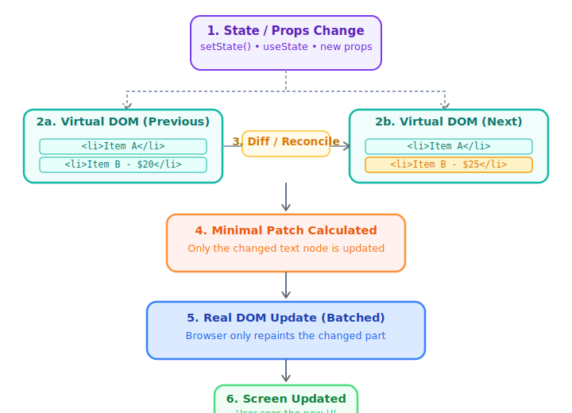
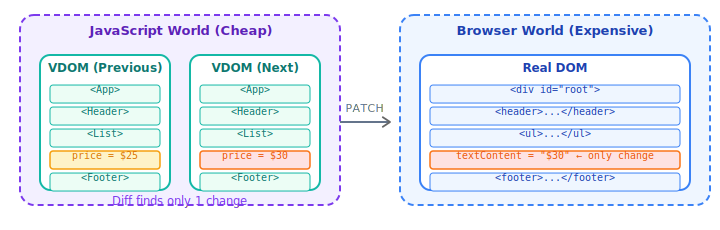

# ⚛️ React Notes — Complete Study Guide

## Syllabus

- ReactJs features (VirtualDOM, Reconciliation)
- Local Environment Setup (Create-react-app, Vite)
- JSX
- Class Components
- Functional Components
- React Object
- Fragment
- Component Styling
- Conditional Rendering
- Lists & Keys
- Props: destructuring, requiring props, PropTypes, default props
- State
- Pure Component
- Memo Component
- Higher Order Component
- Events: Synthetic Event
- Lifecycle Hooks
- Form
- HTTP - Axios
- Interceptors
- Routing
- Redux (State Management)
- Unit Testing (Jest)
- ESLint

---


## What React Is

> **Key Idea: `UI = function(state)`**  
> Instead of manually updating the DOM, React lets you describe **what the UI should look like** — and it handles updates efficiently.

- React is a **JavaScript library** for building user interfaces.
- It is an open-source, **component-based** library.
- Created & maintained by **Facebook**.
- Used to build **Single Page Applications (SPAs)**.
- Allows creation of **reusable UI components**.
- Uses **Virtual DOM** mechanism to fill in data (views) in HTML DOM.

### Traditional Way (Without React)

```html
<div id="app"></div>

<script>
  let count = 0;

  function updateUI() {
    document.getElementById("app").innerText = count;
  }

  function increment() {
    count++;
    updateUI();
  }

  updateUI();
</script>
```

**Problems:** Manual DOM updates, hard to scale, messy when app grows.

### The React Way

```jsx
function App() {
  const [count, setCount] = React.useState(0);

  return (
    <div>
      <h1>{count}</h1>
      <button onClick={() => setCount(count + 1)}>Click</button>
    </div>
  );
}
```

React automatically: tracks state, updates UI, and re-renders efficiently.

---

## React is NOT a Framework

> React is a library — it only takes care of the UI.  
> Angular is a framework — it handles Dependency Injection, CSS encapsulation, httpClient, Form validation, routing, etc.

### Declarative vs Imperative

**Imperative (jQuery style)** — "HOW to do things":
```js
document.getElementById("title").innerText = "Hello";
```

**React (Declarative)** — "WHAT it should look like":
```jsx
<h1>Hello</h1>
```

## Framework vs Library

| Framework | Library |
|-----------|---------|
| Group of libraries to make work easier | Performs specific, well-defined operations |
| Provides ready-to-use tools, standards, templates | Provides reusable functions for code |
| Collection of libraries & APIs | Collection of helper functions, objects |
| Cannot be easily replaced | Can be easily replaced by another |
| Angular, Vue | jQuery, ReactJs, lodash, moment |
| Hospital with full of doctors | A doctor who specializes in one area |


## React vs Angular

| | React | Angular |
|--|-------|---------|
| Type | Library (2013) | Framework (2009) |
| Size | Light-weight | Heavy |
| Language | JSX + JavaScript | HTML + TypeScript |
| Data Flow | Uni-Directional | Two-way |
| DOM | Virtual DOM | Regular DOM |
| HTTP | Axios | HttpClientModule |
| DI | No | Yes |
| Form Validation | No | Yes |
| Extra Libraries | Needed | Not required |
| Focus | UI heavy | Functionality Heavy |

### Ecosystem & Flexibility

React is NOT a full framework — you choose your own stack:
- Use **Next.js** for full-stack apps
- Use libraries for state, routing, animations, etc.

---

# React Features

- **Light-weight**
- **JSX** — HTML-like syntax in JavaScript
- **Components** — easy to build, extend, reuse, loosely coupled
- **One-way Data Binding** — no watchers for bindings
- **Virtual DOM** — fast, efficient updates
- **Easy to learn** — simple design
- **High Performance**

---

## DOM and Virtual DOM

### DOM (Document Object Model)

- A tree-like structure representing the HTML of a web page.
- Allows JavaScript to interact with and modify the page's content, structure, and style.

### Why Virtual DOM?

- Frequent DOM manipulations are expensive and performance-heavy.
- Every time the DOM changes, browser recalculates CSS, runs layout, and repaints the page.
- Virtual DOM minimizes the time it takes to repaint the screen.

### What is Virtual DOM?

- A **lightweight JavaScript object** that is a copy of the real DOM.
- A node tree that lists elements, their attributes, and content as objects.
- React **never reads from real DOM, only writes to it**.

### Virtual DOM Benefits

- **Improved Performance** – Reduces the number of direct DOM manipulations.
- **Optimized Updates** – React intelligently determines the most efficient update path, minimizing costly reflows and repaints.
- **Simplified Development** – Abstracts away complexities of direct DOM manipulation.

### How React Works (Virtual DOM)

1. **Initial Render** – React creates a Virtual DOM tree based on initial JSX.
2. **State Changes** – When state changes, React generates a new Virtual DOM tree.
3. **Diffing** – React compares new Virtual DOM with previous Virtual DOM, identifying what changed.
4. **Reconciliation** – React calculates the minimal real DOM operations needed.
5. **Real DOM Update** – Only necessary changes are applied to the real DOM.

### Shadow DOM vs Virtual DOM

| | Shadow DOM | Virtual DOM |
|--|------------|-------------|
| What | Browser technology for scoping variables and CSS in web components | Concept implemented by React on top of browser APIs |

### ReactDOM

- ReactDOM is the **glue between React and the DOM**.
- React creates a Virtual DOM; ReactDOM efficiently updates the real DOM based on it.

---

## React Reconciliation

- Reconciliation is the process of syncing the Virtual DOM to the actual DOM.
- Tracks changes in component state and renders updated state to the screen.


### Fiber Reconciler (React 16+)
- Asynchronous (new reconciliation engine in React v16)
- Divides work into multiple units (incremental rendering)
- Sets priority for each work unit — can **pause, reuse, and abort** work
- Separates reconciliation into two phases:
  - **Phase 1: Render/Processing** – React creates a list of all UI changes (can be interrupted)
  - **Phase 2: Commit** – React applies the changes to the real DOM (cannot be interrupted)


---

# Virtual DOM vs Real DOM in React

A complete visual guide to how React's reconciliation engine works — from state change to screen update.

## 1. What is the Real DOM?

The **Real DOM** is the browser's live tree representation of your HTML page. Every change (even a single text update) triggers an expensive rendering pipeline:


DOM change → Style calculation → Layout reflow → Repaint → Compositing


## 2. What is the Virtual DOM?

The **Virtual DOM** is React’s lightweight JavaScript copy of the UI. When state/props change, React:

- Builds a new Virtual DOM tree
- Diffs it with the previous one (Reconciliation)
- Calculates the **minimum** changes
- Applies them in **one batch** to the Real DOM

### Virtual DOM Node Example

```js
// <div className="card"><h1>Hello</h1></div> becomes:
{
  type: "div",
  props: { className: "card" },
  children: [
    { type: "h1", props: {}, children: ["Hello"] }
  ]
}
```

## 3. The Full Update Cycle



## 4. The Diffing Algorithm (Reconciliation)

React uses smart heuristics for fast O(n) diffing:

- **Rule 1**: Different element types → entire subtree is replaced (state lost)
- **Rule 2**: Same type → only changed props/attributes are updated
- **Rule 3**: Lists must have stable `key` props for efficient add/move/remove

```jsx
// Recommended
{items.map(item => <li key={item.id}>{item.name}</li>)}
```

## 5. Mental Model



Think of the Virtual DOM as a cheap **blueprint** and the Real DOM as the actual **building**. React only patches the necessary bricks.

## 6. Real DOM vs Virtual DOM Comparison

| Property               | Real DOM                          | Virtual DOM                          |
|------------------------|-----------------------------------|--------------------------------------|
| Location               | Browser memory                    | JavaScript memory                    |
| Creation               | Browser HTML parser               | React (`createElement`)              |
| Update Cost            | Expensive (reflow + repaint)      | Very cheap                           |
| Mutation               | Direct & slow                     | Free (old tree discarded)            |
| When Updated           | Immediately                       | After reconciliation (batched)       |

## 7. Code Example

```jsx
function PriceTag({ price }) {
  return <span className="price">${price}</span>;
}

function App() {
  const [price, setPrice] = useState(10);

  return (
    <div>
      <h1>Product</h1>
      <PriceTag price={price} />
      <button onClick={() => setPrice(p => p + 1)}>
        Increase price
      </button>
    </div>
  );
}
```

Clicking the button only updates the price `<span>` in the Real DOM — everything else stays untouched.

## 8. Key Takeaways

- Real DOM mutations are expensive.
- Virtual DOM makes updates cheap and declarative.
- Reconciliation finds minimal changes.
- Always use `key` props on lists.
- Changing element type (`<div>` → `<span>`) destroys the subtree.
- This is the foundation of React Fiber (still used in React 18+ / 19+).

**React Virtual DOM & Reconciliation Deep Dive**


---

## React Project Structure

| File/Folder | Description |
|-------------|-------------|
| `node_modules/` | npm packages for the entire workspace |
| `public/` | Only files here can be referenced from HTML |
| `src/` | Source files for the root-level application |
| `.gitignore` | Files Git should ignore |
| `package.json` | Configures npm package dependencies |
| `package-lock.json` | Version info for all installed packages |
| `README.md` | Introductory documentation |

### React Project Flow

```
index.html  -->  <div id="root"></div>
index.js    -->  root = ReactDOM.createRoot(document.getElementById('root'))
                 root.render(<App />)
App.js      -->  App Component Code
```

### Mental Model (Important!)

When you write `<App />`, React:
1. Calls function `App()`
2. Gets JSX back
3. Converts JSX to JS objects
4. Updates the real DOM

---

# JSX

> **JSX = JavaScript XML** — HTML-like syntax inside JavaScript.

- **JSX** (JavaScript Syntax Extension) is special syntax for React to represent UI.
- JSX allows adding elements to DOM without using `createElement()` or `appendChild()`.
- JSX looks similar to HTML but **is not HTML**.
- JSX code gets transformed into `React.createElement()` by **Babel**.
- JSX doesn't support void tags — `` is invalid; use `` or `</img>`.
- React DOM uses **camelCase** property naming: `class` → `className`, `tabindex` → `tabIndex`.

### How JSX Works Internally

This JSX:
```jsx
const element = <h1>Hello</h1>;
```
gets converted into:
```js
const element = React.createElement("h1", null, "Hello");
```

### Nested JSX Breakdown

```jsx
// JSX
const element = (
  <div>
    <h1>Hello</h1>
    <p>Welcome</p>
  </div>
);

// Converted JS (what Babel produces)
const element = React.createElement(
  "div",
  null,
  React.createElement("h1", null, "Hello"),
  React.createElement("p", null, "Welcome")
);
```

### Why JSX is Powerful

**1. Embed JavaScript inside UI:**
```jsx
const name = "Prathamesh";
<h1>Hello {name}</h1>
```

**2. Dynamic Rendering:**
```jsx
const isLoggedIn = true;
return (
  <div>
    {isLoggedIn ? <h1>Welcome</h1> : <h1>Please Login</h1>}
  </div>
);
```

**3. Lists Rendering:**
```jsx
const items = ["A", "B", "C"];
return (
  <ul>
    {items.map((item, index) => (
      <li key={index}>{item}</li>
    ))}
  </ul>
);
```

### JSX Rules (Important)

**1. One Parent Element:**

❌ Wrong:
```jsx
return (
  <h1>Hello</h1>
  <p>World</p>
);
```

✅ Correct:
```jsx
return (
  <div>
    <h1>Hello</h1>
    <p>World</p>
  </div>
);
// OR use Fragment
<>
  <h1>Hello</h1>
  <p>World</p>
</>
```

**2. Use `className` not `class`:**
```jsx
<div className="box"></div>
```

**3. Close all tags:**
```jsx

```

### React Without JSX

```js
// Syntax
React.createElement(type, [props], [...children])

// Example
React.createElement("div", { class: "test" }, "This is a div");
// is equivalent to JSX:
// <div class='test'>This is a div</div>
```

> Modern tools like **Vite** and **Babel** automatically convert JSX → JS. You never write `React.createElement` manually.

---

## React Element

- A React element is a JavaScript object with specific properties and methods.
- Created using `React.createElement()`.
- `document.createElement()` returns a **DOM element**.
- `React.createElement()` returns an **object representing the DOM element**.

```js
const hello = React.createElement(
  "H1",
  { id: "msg", className: "title" },
  "Hello React Element"
);
```

---

## Module Systems & Imports/Exports

### CommonJS
```js
module.exports = { member1, member2 };
const member1 = require('Library/file name');
```

### ECMAScript
```js
export member1;
export default member2;
import DefaultMember, { NamedMember } from 'file';
```

### Named Export vs Default Export

- Only **one default export** per file; **multiple named exports** are allowed.
- Default export can be a function, class, or object (not a variable).
- Named import must use the **same name** as the export.
- Default import can use **any name**.

```js
import MyReact, { MyComponent } from "react";
```

---

# Components


# ⚛️ What is a Component?

In **React**, a **component is a reusable, independent piece of UI**.

👉 Think of it like:

* A function
* That returns UI (JSX)
* Based on input (props + state)

---

## 🧠 Mental Model

> Component = Function → takes input → returns UI

```jsx
function Greeting() {
  return <h1>Hello</h1>;
}
```

👉 This is a component.

---

# 🔥 Why Components Are Powerful

* Reusability
* Separation of concerns
* Easy maintenance
* Scalable architecture

---
# Compoenets Rule
- Components are the most basic UI building blocks of a React application.
- Each component outputs a small, reusable piece of HTML.
- Components are **re-usable** and can be nested.
- React requires the **first letter of a component to be capitalized** — this is how JSX tells the difference between an HTML tag and a component instance.

### Component-Based Architecture

React splits UI into reusable pieces:

```jsx
function Button() {
  return <button>Click me</button>;
}

// Reuse anywhere
<Button />
<Button />
```


---


# 🧩 Types of Components (Important)

### 2 Types of Components

| Functional Component | Class Component |
|----------------------|----------------|
| No `this` keyword | More feature-rich |
| Solution without state | Maintains own private data (state) |
| Mainly for UI | Complex UI logic |
| Stateless/dumb/Presentational | Provides lifecycle hooks |

```js
// Functional Component
function Welcome(props) {
  return <h1>Hello, {props.name}</h1>;
}

// Class Component
class Welcome extends React.Component {
  render() {
    return <h1>Hello, {this.props.name}</h1>;
  }
}
```

> **Note:** From React 16.8+, Hooks allow using state and lifecycle in functional components. It is always recommended to use **functional components**.


## 1. Functional Components (Modern Standard ✅)

This is what you SHOULD use in 2026.

```jsx
function Welcome() {
  return <h1>Welcome to React</h1>;
}
```

👉 Use it:

```jsx
<Welcome />
```

---

### With Props (Dynamic Component)

```jsx
function Greeting(props) {
  return <h1>Hello {props.name}</h1>;
}
```

👉 Usage:

```jsx
<Greeting name="Prathamesh" />
```

👉 Output:

```
Hello Prathamesh
```

---

### With Destructuring (Best Practice)

```jsx
function Greeting({ name }) {
  return <h1>Hello {name}</h1>;
}
```

---

## 2. Class Components (Legacy ⚠️)

Used before hooks.

```jsx
class Welcome extends React.Component {
  render() {
    return <h1>Hello</h1>;
  }
}
```

👉 Avoid in modern apps unless maintaining old code.

---

# 🧠 Types Based on Usage Pattern

This is where real understanding starts.

---

## 🔹 3. Presentational Components (UI Only)

👉 Only responsible for UI

```jsx
function Button({ label }) {
  return <button>{label}</button>;
}
```

👉 No logic, just display

---

## 🔹 4. Container Components (Logic Handling)

👉 Handles data & logic

```jsx
function CounterContainer() {
  const [count, setCount] = React.useState(0);

  return (
    <button onClick={() => setCount(count + 1)}>
      {count}
    </button>
  );
}
```

---

## 🔹 5. Controlled Components

👉 Form elements controlled by React state

```jsx
function InputField() {
  const [value, setValue] = React.useState("");

  return (
    <input
      value={value}
      onChange={(e) => setValue(e.target.value)}
    />
  );
}
```

👉 React controls the input

---

## 🔹 6. Uncontrolled Components

👉 DOM handles state

```jsx
function InputField() {
  const inputRef = React.useRef();

  function handleClick() {
    console.log(inputRef.current.value);
  }

  return (
    <>
      <input ref={inputRef} />
      <button onClick={handleClick}>Submit</button>
    </>
  );
}
```

---

## 🔹 7. Higher-Order Components (HOC)

👉 Function that wraps another component

```jsx
function withLogger(Component) {
  return function WrappedComponent(props) {
    console.log("Rendering...");
    return <Component {...props} />;
  };
}
```

👉 Usage:

```jsx
const Enhanced = withLogger(MyComponent);
```

---

## 🔹 8. Custom Hook Components (Logic Reuse)

👉 Not UI, but reusable logic

```jsx
function useCounter() {
  const [count, setCount] = React.useState(0);
  return { count, setCount };
}
```

👉 Use inside component:

```jsx
function Counter() {
  const { count, setCount } = useCounter();

  return (
    <button onClick={() => setCount(count + 1)}>
      {count}
    </button>
  );
}
```

---

## 🔹 9. Compound Components (Advanced Pattern)

👉 Components that work together

```jsx
function Card({ children }) {
  return <div className="card">{children}</div>;
}

Card.Title = function ({ children }) {
  return <h2>{children}</h2>;
};

Card.Body = function ({ children }) {
  return <p>{children}</p>;
};
```

👉 Usage:

```jsx
<Card>
  <Card.Title>Title</Card.Title>
  <Card.Body>Description</Card.Body>
</Card>
```

---

## 🔹 10. Layout Components

👉 Used for structure

```jsx
function Layout({ children }) {
  return (
    <div>
      <header>Header</header>
      <main>{children}</main>
    </div>
  );
}
```

---

# 🔄 Component Lifecycle (Functional Way)

Earlier (class):

* componentDidMount
* componentDidUpdate

Now:
👉 handled using `useEffect`

```jsx
function Example() {
  React.useEffect(() => {
    console.log("Mounted");

    return () => {
      console.log("Unmounted");
    };
  }, []);

  return <h1>Example</h1>;
}
```

---


# ⚛️ What are Props?

In **React**, **props (short for properties)** are:

> 👉 Inputs passed from a parent component to a child component

They allow components to be **dynamic and reusable**.

---

## 🧠 Simple Analogy

Think of a component like a function:

```js
function greet(name) {
  return "Hello " + name;
}
```

👉 `name` = input

Similarly in React:

```jsx
function Greeting(props) {
  return <h1>Hello {props.name}</h1>;
}
```

👉 `props.name` = input

---

# 🔹 Basic Example

### Parent Component

```jsx
function App() {
  return <Greeting name="Prathamesh" />;
}
```

### Child Component

```jsx
function Greeting(props) {
  return <h1>Hello {props.name}</h1>;
}
```

👉 Output:

```
Hello Prathamesh
```

---

# 🔥 Props Flow (VERY IMPORTANT)

👉 Props flow **one-way (top → down)**

```
Parent → Child → Grandchild
```

❌ Child cannot directly change parent props

---

# 🧩 Multiple Props

```jsx
function User({ name, age }) {
  return (
    <h1>
      {name} is {age} years old
    </h1>
  );
}
```

👉 Usage:

```jsx
<User name="Prathamesh" age={25} />
```

---

# 🎯 Props with Different Types

## 1. String

```jsx
<Greeting name="John" />
```

---

## 2. Number

```jsx
<User age={25} />
```

---

## 3. Boolean

```jsx
<Button isActive={true} />
```

---

## 4. Array

```jsx
function List({ items }) {
  return (
    <ul>
      {items.map((item) => (
        <li key={item}>{item}</li>
      ))}
    </ul>
  );
}
```

👉 Usage:

```jsx
<List items={["A", "B", "C"]} />
```

---

## 5. Object

```jsx
function Profile({ user }) {
  return <h1>{user.name}</h1>;
}
```

👉 Usage:

```jsx
<Profile user={{ name: "Prathamesh" }} />
```

---

## 6. Function (VERY IMPORTANT)

👉 Used for event handling & communication

```jsx
function Button({ onClick }) {
  return <button onClick={onClick}>Click</button>;
}
```

👉 Parent:

```jsx
function App() {
  function handleClick() {
    alert("Clicked!");
  }

  return <Button onClick={handleClick} />;
}
```

---

# 🔄 Props Are Read-Only (IMPORTANT)

❌ Wrong:

```jsx
function Greeting(props) {
  props.name = "Changed"; // ❌ not allowed
}
```

👉 Props are immutable

---

# 🧠 Destructuring Props (Best Practice)

Instead of:

```jsx
function Greeting(props) {
  return <h1>{props.name}</h1>;
}
```

✅ Do this:

```jsx
function Greeting({ name }) {
  return <h1>{name}</h1>;
}
```

---

# 🧩 Default Props

```jsx
function Greeting({ name = "Guest" }) {
  return <h1>Hello {name}</h1>;
}
```

👉 Usage:

```jsx
<Greeting />
```

👉 Output:

```
Hello Guest
```

---

# 🧒 Children Prop (VERY IMPORTANT)

Every component automatically gets a special prop:

👉 `children`

```jsx
function Card({ children }) {
  return <div className="card">{children}</div>;
}
```

👉 Usage:

```jsx
<Card>
  <h1>Title</h1>
  <p>Description</p>
</Card>
```

👉 Output:

```
Card containing Title + Description
```

---

# 🔁 Props vs State (Common Confusion)

| Props              | State                    |
| ------------------ | ------------------------ |
| Passed from parent | Managed inside component |
| Read-only          | Mutable                  |
| External data      | Internal data            |

---

# 🔥 Real-World Example

```jsx
function ProductCard({ name, price, onBuy }) {
  return (
    <div>
      <h2>{name}</h2>
      <p>₹{price}</p>
      <button onClick={onBuy}>Buy</button>
    </div>
  );
}
```

👉 Parent:

```jsx
function App() {
  function handleBuy() {
    alert("Purchased!");
  }

  return (
    <ProductCard
      name="Laptop"
      price={50000}
      onBuy={handleBuy}
    />
  );
}
```

---

# ⚠️ Common Mistakes

### ❌ Forgetting `{}` for JS

```jsx
<User age="25" />   // string ❌
<User age={25} />   // number ✅
```

---

### ❌ Mutating Props

Never do:

```jsx
props.value = 10;
```

---

### ❌ Overusing Props (Prop Drilling)

Passing props deeply:

```jsx
<App → Parent → Child → Grandchild>
```

👉 Solution:

* Context API
* State management

---

# 🧠 Advanced Concept: Props Drilling

```jsx
function App() {
  return <Parent name="Prathamesh" />;
}

function Parent({ name }) {
  return <Child name={name} />;
}

function Child({ name }) {
  return <h1>{name}</h1>;
}
```

👉 Passing through layers = prop drilling

---

# ⚡ Final Mental Model

> Props = Input to component
> State = Memory inside component

---

---

# 🧠 Important Concepts You MUST Understand

## 1. Props (Read-only input)

```jsx
function User({ name }) {
  return <h1>{name}</h1>;
}
```

👉 Cannot modify props inside component ❌

---

## 2. State (Internal data)

```jsx
const [count, setCount] = React.useState(0);
```

👉 Changes trigger re-render

---

## 3. Re-rendering

Whenever:

* State changes
* Props change

👉 Component re-renders

---

# 🔥 Real Example (Putting Everything Together)

```jsx
function UserCard({ name }) {
  const [likes, setLikes] = React.useState(0);

  return (
    <div>
      <h2>{name}</h2>
      <p>Likes: {likes}</p>
      <button onClick={() => setLikes(likes + 1)}>
        Like
      </button>
    </div>
  );
}
```

👉 Usage:

```jsx
<UserCard name="Prathamesh" />
```

---

# ⚡ Best Practices (Senior Level)

* Keep components small
* Reuse components
* Extract logic into hooks
* Avoid prop drilling (use context)
* Separate UI & logic

---

# 🧠 Final Mental Model

Think like this:

```
App
 ├── Header
 ├── Sidebar
 ├── Content
 │    ├── Card
 │    ├── Table
 │    └── Chart
 └── Footer
```

👉 Everything is a component.

---

## React.StrictMode

- A tool for highlighting potential problems in a React application.
- Activates additional checks and warnings for its descendants.
- Strict mode checks run in **development mode only** (do not impact production).
- **Renders components twice** in dev mode to detect side effects and potential issues.

```jsx
import React, { StrictMode } from "react";
<StrictMode>
  <App />
</StrictMode>
```

**StrictMode helps with:**
- Identifying components with unsafe lifecycles (`componentWillMount`)
- Warning about legacy string ref API usage
- Warning about deprecated `findDOMNode()` usage
- Detecting unexpected side effects
- Detecting legacy context API

---

# Fragments

- JSX can only return **1 element** at a time.
- Fragments allow rendering multiple elements **without adding extra DOM nodes**.

```jsx
// Long form
import { Fragment } from 'react';
<Fragment>
  <div>Element 1</div>
  <button>Element 2</button>
</Fragment>

// Short form (React 16.2+)
<>
  <div>Element 1</div>
  <button>Element 2</button>
</>
```

---

## Data Binding & CSS

### Data Binding

| Type | Description | React Example |
|------|-------------|---------------|
| One-way Binding | State → UI | `{value}` |
| Two-way Binding | State ↔ UI using onChange | `value + onChange` |

### CSS in React

Different ways to add CSS:
1. Inline CSS
2. External CSS
3. Global CSS (`index.css`)
4. **CSS Modules**
5. Conditional CSS

### CSS Modules

- Fixes the problem of global scope in CSS.
- All class names are scoped locally by default.
- Prevents naming clashes across files.
- Auto-generates unique class names in format: `[filename]_[classname]__[hash]`

```js
import styles from './Button.module.css';
<button className={styles.error}>Error Button</button>
```

---

## Conditional Rendering

Allows rendering different elements based on conditions.

**Use cases:** Showing/hiding elements, toggling functionality, authentication.

**Methods:**
- `if...else` Statement
- `switch` Statement
- Ternary Operator
- Logical `&&` (Short Circuit Evaluation)

```jsx
// Ternary
<div>{flag ? <h1>Hello</h1> : null}</div>

// Short Circuit
<div>{flag && <h1>Hello</h1>}</div>
```

---

## Lists and Keys

- A `key` is a special attribute required when creating list items.
- Console warning appears if key prop is missing.
- Keys give elements a **stable unique identity**.
- Helps React identify which items changed, were added, or removed.

```jsx
{EmployeeArr.map((emp, ind) => (
  <option key={ind} value={emp} />
))}
```

> **Tip:** Avoid using index as key if the list is filtered or sorted — it causes React to consider items as different elements and repaint the whole list.

> **Note:** `map()` is used instead of `forEach()` because JSX needs an array of items — `forEach()` returns `undefined`, `map()` returns an array.

### Read Data from JSON / JS File

```js
// 1. Create employees.json
// 2. Import it
import EmployeeArr from './employees.json';
// 3. Use in JSX
{EmployeeArr.map((emp, ind) => (
  <option key={ind} value={emp} />
))}
```

---

## Props

- Props are **inputs to components**.
- Props stand for **properties** — a special keyword in React.
- Pass custom data from **parent to child** (uni-directional flow).
- Props are **immutable** — child components should not change them.

```jsx
<ChildComponent someAttribute={value} anotherAttribute={value} />

// Access in class component
this.props.propName

// Access in functional component
props.propName
```

### Props Destructuring

```jsx
// Functional Component
export default function Greet({ name, msg }) {}

// Class Component
let { pId, name, price } = this.props.product;
```

### PropTypes

```bash
npm install prop-types
```

```js
import PropTypes from 'prop-types';

ComponentName.propTypes = {
  name: PropTypes.string,
  age: PropTypes.number,
  optionalArray: PropTypes.array,
  optionalBool: PropTypes.bool,
  optionalFunc: PropTypes.func,
  optionalEnum: PropTypes.oneOf(['News', 'Photos']),
  optionalObjectWithShape: PropTypes.shape({
    color: PropTypes.string,
    fontSize: PropTypes.number,
  }),
};
```

### Requiring Props

```js
Student.propTypes = {
  name: PropTypes.string.isRequired, // Required
  age: PropTypes.number,             // Optional
};
```

### Default Props

```js
Greet.defaultProps = {
  msg: 'this is my default message'
};

// OR destructuring
export default function Greet({ name, msg = 'good morning' }) {}
```

### Props.children

```jsx
<Welcome>Hello world!</Welcome>

class Welcome extends React.Component {
  render() {
    return <p>{this.props.children}</p>;
  }
}
```

### Prop Drilling

- Passing props through components that don't need the data.
- Creates issues with component reusability and performance.
- Solved by **Context API** or **Redux**.

---

## State

- The State of a component is an object that holds data that may **change over the component's lifetime**.
- When state changes, React **re-renders** the component.
- States are **mutable** and **local** to the component.

### Why State Variables (vs Local Variables)?

| Local Variable | State Variable |
|----------------|----------------|
| Changing doesn't re-render | Changing triggers re-render |
| Re-created on each render (no persistence) | Persisted across re-renders |

### State in Class Component

```js
// Initialize in constructor
this.state = { counter: 0 };

// Update with setState
this.setState({ counter: this.state.counter + 1 });

// setState is asynchronous — use callback for post-update code
this.setState({ counter: 1 }, () => { /* runs after update */ });

// Update based on previous state
this.setState(prevState => ({ value: prevState.value + 1 }));
```

### State in Functional Component

```js
const [count, setCount] = useState(0);

// Update based on previous state
setCount(prevState => prevState + 1);

// Code after state update — use useEffect
```

### Props vs State

| Props | State |
|-------|-------|
| Immutable | Mutable |
| Passed from parent to child | Contains own data, changes over time |
| For component communication | For rendering dynamic changes |
| `props` (Functional), `this.props` (Class) | `useState()` (Functional), `this.state={}` (Class) |

---

## React Events

- React events are written in **camelCase**: `onClick`, `onChange`
- Event handlers written inside **curly braces**: `onClick={shoot}`
- Use **arrow functions** so `this` refers to the component.

```jsx
<button onClick={shoot}>Take the Shot!</button>       // calls on click
<button onClick={shoot()}>Take the Shot!</button>     // calls on load (wrong!)
```

### Binding `this` in Class Components

```js
// Arrow function (recommended)
shoot = (a) => { alert(a); }
<button onClick={() => this.shoot("Goal")}>Take the shot!</button>

// Bind in constructor
constructor(props) {
  super(props);
  this.f1 = this.f1.bind(this);
}
```

### Single Event Handler for Multiple Inputs

```js
const changeHandler = (e) => {
  const { name, value } = e.target;
  this.setState({ [name]: +value });
};
```

### SyntheticEvent

- `SyntheticEvent` is a cross-browser wrapper around the browser's native event.
- React event handlers receive `SyntheticEvent` instead of the native event.

```jsx
// Bubbling phase
<button onClick={f1}>click me</button>

// Capture phase
<button onClickCapture={f1}>click me</button>
```

---

## Component Communication

- **Parent → Child:** Props
- **Child → Parent:** Callback and states
- **Between Siblings:** Combine the above two

### Child to Parent

```js
// 1. Define a function in parent
// 2. Pass function as prop to child
// 3. Call this.props.callback(data) in the child
```

---

## PureComponent & Memo

### PureComponent

- Same as `Component` but handles `shouldComponentUpdate` automatically.
- Does a **shallow comparison** on props and state.
- Only re-renders if props/state actually changed.

```js
class myComp extends React.PureComponent {}
```

> In Functional Components, every component is a PureComponent by default — re-render happens only when state/props change.

### React.memo()

- Higher-order component/function (React 16.6+).
- Renders a component **only if its props change**.
- Used with child components receiving props.

```js
export default React.memo(MyComponent);
```

### useMemo()

- Memoizes an **expensive computed value**.
- Only re-computes when dependencies change.

```js
const calculation = useMemo(() => expensiveCalculation(count), [count]);
```

### useCallback()

- Memoizes a **callback function**.
- Prevents re-rendering child components that receive functions as props.

```js
const addTodo = useCallback(() => {
  setTodos(t => [...t, "New Todo"]);
}, []);
```

---

## Lifecycle Hooks

Every React class component goes through three phases:

### 1. Mounting

Order: `constructor` → `getDerivedStateFromProps` → `render` → `componentDidMount`

**constructor()**
- Called first when component is initiated.
- Natural place to set initial state.
- Always call `super(props)` first.
- Do NOT call `setState()` in constructor.

**static getDerivedStateFromProps(props, state)**
- Called right before rendering.
- Returns object with state changes based on props.

**render()**
- Required method that outputs HTML to the DOM.
- Re-invoked when state/props changes.

**componentDidMount()**
- Called after component is rendered.
- Best place for **API calls** and **DOM manipulation**.

### 2. Updating

Order: `getDerivedStateFromProps` → `shouldComponentUpdate` → `render` → `getSnapshotBeforeUpdate` → `componentDidUpdate`

**shouldComponentUpdate()**
- Returns a boolean specifying whether to continue rendering.
- Default is `true`.

**getSnapshotBeforeUpdate(prevProps, prevState)**
- Access to props and state before the update.

**componentDidUpdate()**
- Called after component is updated in the DOM.
- Not called for the initial render.

### 3. Unmounting

**componentWillUnmount()**
- Called immediately before component is destroyed.
- Use for cleanup: cancel network requests, clear timers, unsubscribe, detach event handlers.

### useEffect() — Functional Component Equivalent

```js
// Runs once on mount (like componentDidMount)
useEffect(() => {}, []);

// Runs on every state change (no 2nd argument)
useEffect(() => {});

// Runs when 'count' changes (like componentDidUpdate)
useEffect(() => {}, [count]);

// Cleanup on unmount (like componentWillUnmount)
useEffect(() => {
  return () => { /* cleanup */ };
}, []);
```

### useLayoutEffect()

- Fires **before** the browser repaints the screen.
- Runs synchronously after all DOM mutations.
- Use when you need to mutate the DOM inside the effect.

---

## Refs

- Provide a way to access DOM nodes or React elements.
- Used to manage focus, text selection, animations.

```js
// Class Component
this.myRef1 = React.createRef();

// Functional Component
const myRef1 = useRef();

// Callback Ref
<input ref={x => inputRef1 = x} />
```

- **Ref Forwarding** — lets components pass/forward a ref to a child.

---

## Forms

- React uses forms to collect user data.
- Use `event.target.value` for field value, `event.target.name` for field name.
- Use `event.preventDefault()` to prevent page refresh on submit.

### Controlled vs Uncontrolled Components

| Feature | Uncontrolled | Controlled |
|---------|-------------|------------|
| One-time value retrieval | ✅ | ✅ |
| Validating on submit | ✅ | ✅ |
| Default value | ✅ | ✅ |
| Field-level Validation | ❌ | ✅ |
| Conditionally disabling submit | ❌ | ✅ |
| Enforcing input format | ❌ | ✅ |
| Dynamic inputs | ❌ | ✅ |

```jsx
// Controlled input
<input onChange={this.onChange} value={this.state.name} />

// Textarea in React
<textarea value={this.state.description} />

// Select in React
<select value={this.state.mycar}>
  <option value="Ford">Ford</option>
</select>
```

### NPM Libraries for Form Handling
- [react-hook-form](https://www.npmjs.com/package/react-hook-form)
- [formik](https://www.npmjs.com/package/formik)
- [yup](https://www.npmjs.com/package/yup)

---

## HTTP Methods & Axios

### HTTP Methods

| Method | Purpose | Example |
|--------|---------|---------|
| `GET` | Retrieve data from DB | Search |
| `POST` | Send data to server, create a resource | Sign up |
| `PUT` | Create or replace a resource | Update profile |
| `PATCH` | Partial update of a resource | Update password |
| `DELETE` | Remove a resource | Delete account |

### HTTP Status Codes

- `1xx` Informational: 100-Continue, 101-Switching Protocols
- `2xx` Success: 200-OK, 201-Created, 204-No Content
- `3xx` Redirection: 301-Moved Permanently, 304-Not Modified
- `4xx` Client Error: 400-Bad Request, 401-Unauthorized, 403-Forbidden, 404-Not Found
- `5xx` Server Error: 500-Internal Server Error, 502-Bad Gateway, 503-Service Unavailable

### Ways to Fetch Data in React

1. `fetch()` with `.then()`
2. `async/await` syntax
3. Axios library
4. Custom hooks

### HTTP with fetch()

```js
fetch('https://jsonplaceholder.typicode.com/todos/1')
  .then(response => response.json())
  .then(data => console.log(data));
```

### Async/Await

```js
const fetchProducts = async function () {
  const products = await fetch("https://fakestoreapi.com/products");
  const productsJSON = await products.json();
  setProducts(productsJSON);
};
```

### HTTP with Axios

```bash
npm i axios
```

```js
import axios from 'axios';

const fetchUsers = async () => {
  const url = "https://jsonplaceholder.typicode.com/users";
  const response = await axios.get(url);
  setUsers(response.data);
};
```

### Axios vs fetch()

| Axios | fetch() |
|-------|---------|
| Built-in XSRF protection | ❌ |
| Uses `data` property | Uses `body` property (must be stringified) |
| Automatic JSON transforms | Two-step process |
| Request timeout & cancellation | ❌ |
| HTTP interceptors built-in | ❌ |
| Download progress support | No upload progress |

### Create Axios Instance

```js
// api.js
import axios from 'axios';
const client = axios.create({ baseURL: 'http://jsonplaceholder.typicode.com/' });
export default client;

// Usage
import client from 'api.js';
client.get('/users');
```

### Multiple Requests with Axios

```js
const [response1, response2] = await axios.all([
  axios.get('https://api.github.com/users/defunkt'),
  axios.get('https://api.github.com/users/evanphx')
]);
```

### HTTP Interceptors

```
HTTP Request → Interceptor → Modified Request → Server
Server → HTTP Response → Interceptor → Modified Response → Component
```

**Request Interceptor:**
```js
axios.interceptors.request.use((req) => {
  req.headers.authorization = "my secret token";
  return req;
});
```

**Response Interceptor:**
```js
axios.interceptors.response.use(
  res => res,
  err => {
    if (err.response.status === 404) {
      throw new Error(`${err.config.url} not found`);
    }
    throw err;
  }
);
```

**Remove an Interceptor:**
```js
const myInterceptor = axios.interceptors.request.use(function () {/*...*/});
axios.interceptors.request.eject(myInterceptor);
```

### Fake REST APIs for Testing

1. https://jsonplaceholder.typicode.com/
2. https://reqres.in/
3. https://fakestoreapi.com/products
4. https://api.github.com/users/google
5. https://dummyjson.com/products

### Create REST API with json-server

```bash
npm install -g json-server
json-server --watch db.json --port=4000
```

Available routes: `GET /employees`, `POST /employees`, `PUT /employees/:id`, `DELETE /employees/:id`

---

## Higher Order Components (HOCs)

- A technique for **re-using component logic**.
- Takes one or more components as arguments and returns a **new upgraded component**.

```js
newComponent = higherOrderComponent(originalComponent);
```

**Use cases:** Authentication, Logging, Styling and Theming, Infinite scroll, Data subscription, Shared search features.

---

## Routing

- **Single Page Applications (SPAs)** load a single HTML page and dynamically update it.
- React Router makes sure the app loads components when the URL changes.

### Types of Routes

| Type | URL Example |
|------|-------------|
| BrowserRouter (classic URLs) | `https://app.com/dashboard` |
| HashRouter (for older browsers) | `https://app.com/#/dashboard` |

### Setup Steps

```bash
npm install react-router-dom
```

```jsx
// index.js
import { BrowserRouter } from 'react-router-dom';
<BrowserRouter><App /></BrowserRouter>

// App.js (Body)
import { Routes, Route } from 'react-router-dom';
<Routes>
  <Route exact path="/" element={<Home />} />
  <Route path="/aboutus" element={<AboutUs />} />
  <Route path="*" element={<NotFound />} /> {/* No match route */}
</Routes>

// Navigation
<Link to="/">Home</Link>
<Link to="/about">About Us</Link>
```

### Link vs NavLink

- `<Link>` — no active class on selected element.
- `<NavLink>` — adds an **active class** to the selected element.

```jsx
<NavLink to='home' className='nav-link'>Home</NavLink>
```
```css
nav a.active { text-decoration: none; font-weight: bolder; background-color: aqua; }
```

### Programmatic Navigation

```js
import { useNavigate } from 'react-router-dom';
const navigate = useNavigate();
navigate('/products');

// Navigate back/forward
navigate(-1); // Back
navigate(1);  // Forward
```

### Route Params

**Path Params:**
```jsx
<Route path="/productdetails/:id" element={<ProductDetails />} />
<Link to={`/productdetails/${id}`}>View Details</Link>

// In ProductDetails
const { id } = useParams();
```

**Query Params:**
```jsx
navigate({ pathname: "/productdetails", search: `?${createSearchParams({ title, price })}` });

const [searchParams] = useSearchParams();
searchParams.get("title");
```

### Nested Routing

```jsx
<Route path="/products" element={<Products />}>
  <Route path="featured" element={<FeaturedProducts />} />
  <Route path="new" element={<NewProducts />} />
</Route>

// In Products component — add Outlet
<Outlet />
```

### Protected Routes

- Routes that can only be accessed if a condition is met (e.g., user is authenticated).
- Returns a component or redirects to sign-in page based on a condition.

### Replace (History)

```jsx
// HTML
<Navigate to="/home" replace />

// JavaScript
navigate("/home", { replace: true });
```

Used after login to prevent users from going back to login page.

### Code Splitting / Lazy Loading

```jsx
const OtherComponent = React.lazy(() => import('./OtherComponent'));

<Suspense fallback={<div>Loading...</div>}>
  <OtherComponent />
</Suspense>
```

---

## Error Handling & Error Boundaries

### When to Use try-Catch
- Handling errors in specific code blocks.
- Handling errors in event handlers.
- Handling errors in server-side rendering.

### Error Boundaries

- React components that catch JavaScript errors anywhere in their child component tree.
- Display a **fallback UI** instead of crashing the app.
- Only supported in **class components**.
- Does NOT catch errors in: event handlers, async code, SSR, or inside the boundary itself.

```js
class ErrorBoundary extends React.Component {
  static getDerivedStateFromError(error) {
    return { hasError: true }; // Render fallback UI
  }
  componentDidCatch(error, info) {
    logToDatabase(error, info);
  }
}
```

---

### Dependencies vs DevDependencies

```bash
# Production dependency (needed in dev AND production)
npm i bootstrap

# Development-only dependency
npm i --save-dev eslint
```

---

## Context API

- Helps avoid **prop drilling** and shares global state easily.
- Pass data through the component tree without intermediate props.
- Ideal for **small applications** with minimal state changes.
- Use cases: authenticated user, theme, preferred language.

```js
// 1. Create context
export const MyContext = React.createContext(defaultValue);

// 2. Provide context
<MyContext.Provider value={/* some value */}>
  <ComponentX />
</MyContext.Provider>

// 3. Consume context (Functional Component)
const myContextObj = useContext(MyContext);

// 3. Consume context (Class Component)
<MyContext.Consumer>
  {value => /* render something */}
</MyContext.Consumer>
```

---


## React Hooks

- Hooks let you "hook into" React features in functional components.
- Added in **React 16.8**.

### Rules of Hooks

1. Only call Hooks **at the top level** (not inside loops, conditions, or nested functions).
2. Only call Hooks from **React function components** or custom hooks.

### Built-in Hooks

`useState`, `useEffect`, `useRef`, `useContext`, `useReducer`, `useCallback`, `useMemo`, `useId`, `useDebugValue`, `useDeferredValue`

### useState

```js
const [count, setCount] = useState(0);
// Returns: [currentState, updaterFunction]
```

### useEffect

```js
useEffect(() => {
  // Side effect logic
  return () => { /* cleanup */ };
}, [dependencies]);
```

### useReducer

```js
// Similar to Redux but for local state
const [todos, dispatch] = useReducer(reducer, initialTodos);
```

**useReducer vs Redux:**

| useReducer | Redux |
|------------|-------|
| Local state | Centralized app state |
| No extra dependencies | Has middlewares (Thunk, Sagas, logger) |
| Suitable for small projects | Suitable for big projects |

### useId()

```jsx
const id = useId();
<label htmlFor={id}>Do you like React?</label>
<input id={id} type="checkbox" name="react" />
```

### Custom Hooks

- Reusable functions that start with `use`.
- Can call other hooks.
- Each call to a custom hook gets isolated state.

```js
function useCustomHook() {
  const [state, setState] = useState(initialValue);
  // logic...
  return state;
}
```
